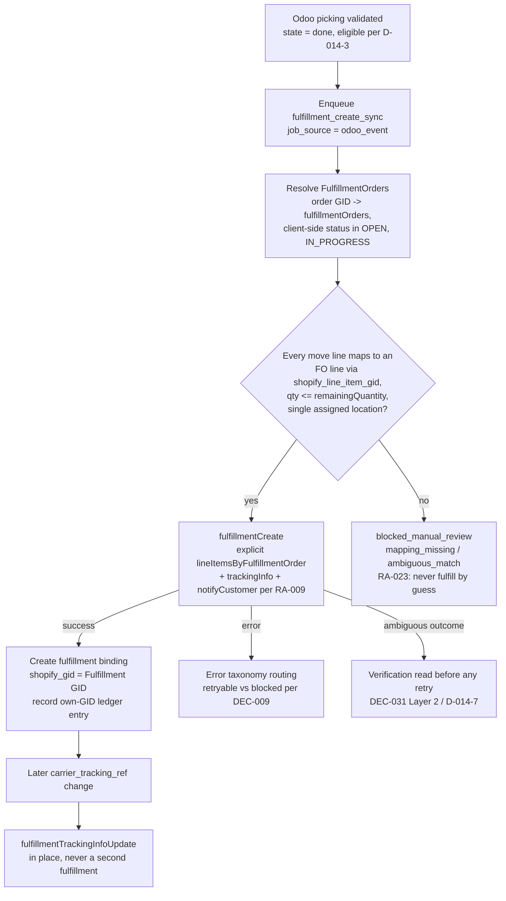
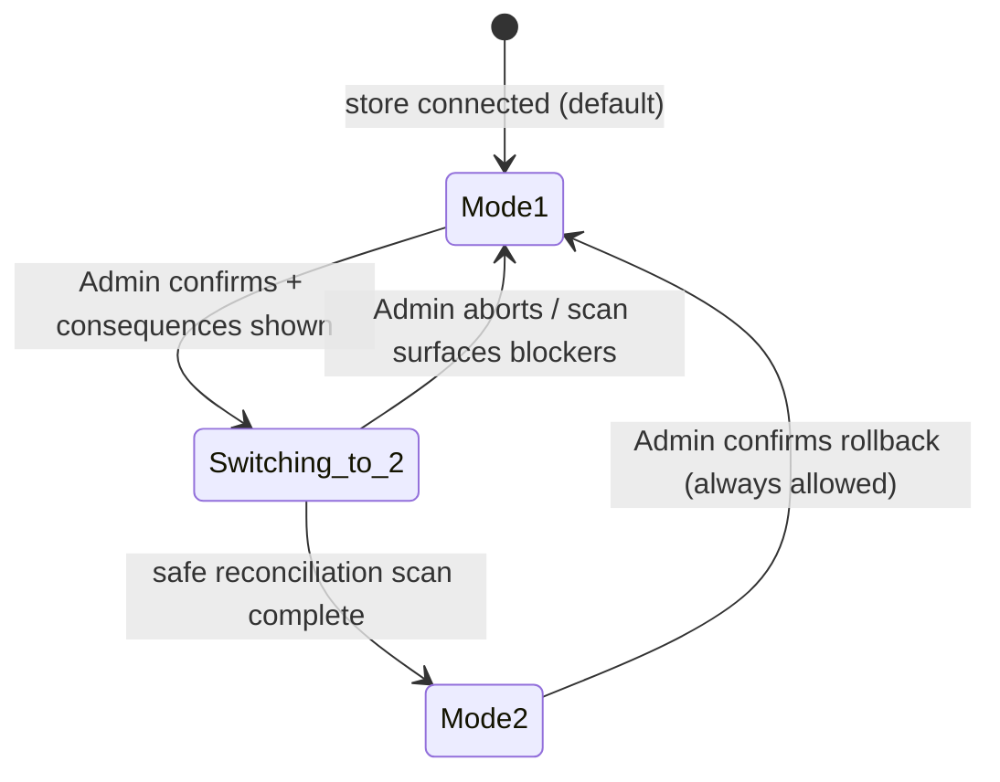

# Fulfillment Operating Modes — Odoo-Controlled vs Bidirectional Exact Reconciliation

> **Status: Proposed — Fable gap-closure mission, 2026-07-16.** Not accepted;
> acceptance authority: product owner + Claude control room; feeds the revised
> Task 014 packet (Wave 4). No implementation authorized. This document layers
> per-store *operating modes* on top of the outbound design already closed in
> [`../07-implementation-plan/task-014-fulfillment-tracking-implementation-packet.md`](../07-implementation-plan/task-014-fulfillment-tracking-implementation-packet.md)
> (D-014-1..8 respected in full); it does not reopen those closures.
> Companion document: [`shopify-fulfillment-status-model.md`](shopify-fulfillment-status-model.md).
> Evidence base: [`../00-source-materials/shopify-orders-cod-abandoned-fulfillment-captures-2026-07-16.md`](../00-source-materials/shopify-orders-cod-abandoned-fulfillment-captures-2026-07-16.md)
> §6–§7 and [`../00-source-materials/odoo19-sale-stock-security-captures-2026-07-16.md`](../00-source-materials/odoo19-sale-stock-security-captures-2026-07-16.md)
> §2. Rejected-approach constraints honored: RA-009 (notification default-off),
> RA-022 (FulfillmentOrder-based mutations only), RA-023 (never fulfill by
> order-ID alone / without exact FO-line matching) — see
> [`../05-qa/rejected-approaches-log.md`](../05-qa/rejected-approaches-log.md).

---

## 1. Mode overview and selection setting

[Proposed product decision] The **Administrator selects exactly one fulfillment
operating mode per store** (a per-store selection field on the connector store
settings, Administrator-only, audited):

| Mode | Name | One-line contract | Default |
|---|---|---|---|
| **Mode 1** | **Odoo-controlled** | Odoo is the warehouse execution system. Odoo delivery validation drives Shopify fulfillment. External Shopify fulfillments are detected and reconciled into **review cases** — they never touch Odoo stock automatically. | **Yes (default + recommended)** |
| **Mode 2** | **Bidirectional exact reconciliation** | Everything Mode 1 does, **plus**: an externally created Shopify fulfillment may auto-validate the corresponding Odoo delivery — **only** when every exact safety condition in §4 passes. Any ambiguity falls back to Mode 1 behavior (User review, no stock change). | No — explicit opt-in |

[Recommendation] Mode 1 is the default because it is the only mode with zero
automated inbound stock mutation; Mode 2 is strictly additive and fails closed
into Mode 1 behavior. [Fact] Odoo stock validation is the event that moves real
inventory (`stock.picking` `done`; Odoo capture §2), so inbound automation is
the single highest-risk surface of the whole connector — hence the exactness
bar in §4.

**Two-role model.** *Administrator* = connector administrator group (selects
mode, enables Mode 2, confirms switches). *User* = operator group (works review
cases, imports tracking, explicitly validates proposed actions). Consistent
with [`../01-research/wave-0-roles-permissions-and-fulfillment-scope-refresh.md`](../01-research/wave-0-roles-permissions-and-fulfillment-scope-refresh.md),
including its merchant-managed scope correction
(`read/write_merchant_managed_fulfillment_orders`, not
`read_fulfillments`/assigned/third-party scopes — capture §6.5, D-014-2).

---

## 2. Mode 1 — Odoo-controlled (complete design)

### 2.1 Outbound flow (Odoo → Shopify)

This is the Task 014 packet flow, restated as the Mode 1 core. [Fact]
Validating an eligible outgoing picking (D-014-3: `outgoing`,
`location_dest usage = customer`, `state = done`, bound sale order, domain
enabled) creates exactly one Shopify fulfillment via `fulfillmentCreate`
with **explicit** `lineItemsByFulfillmentOrder` line lists (capture §6.5;
RA-022/RA-023), carrier + tracking from `carrier_id.name` /
`carrier_tracking_ref` / `carrier_tracking_url` (D-014-6; Odoo capture §2
carrier fields), and `notifyCustomer` persisted at enqueue, default **off**
(RA-009).

- **Failure/retry** routes through the accepted error taxonomy
  ([`DEC-009`](../04-decisions/DEC-009-error-retry-idempotency-strategy.md)):
  retryable transport/throttle errors retry with backoff; semantic errors
  (`userErrors`) become review cases.
- **Uncertain outcome:** [Fact] `fulfillmentCreate` has **no documented
  idempotency key** (capture §6.5), so an ambiguous outcome (timeout/unknown)
  must trigger a **verification read before any retry** — re-query the order's
  fulfillments and FO `remainingQuantity`, adopt a matching fulfillment if
  found (D-014-7; replay-safety framework:
  [`DEC-031`](../04-decisions/DEC-031-core-r2-job-execution-replay-safety.md)
  Layer 2).

### 2.2 Inbound posture in Mode 1

[Proposed product decision] In Mode 1 the connector **observes** every Shopify
fulfillment (webhooks `fulfillments/create|update`, `fulfillment_orders/*`,
`fulfillment_events/*` — capture §6.7 — backstopped by the reconciliation scan,
capture §7 "your app shouldn't rely on receiving data from Shopify webhooks"),
classifies its origin (§3), records the evidence (§5), and:

- **Connector-created** fulfillment observed inbound → treated as confirmation
  of our own outbound operation; snapshots updated; **never validates Odoo
  again** (idempotent by binding + own-GID ledger).
- **Any external** fulfillment → an understandable **User review case**, with
  zero Odoo stock modification. The User may, from the case: **import the
  tracking** onto the Odoo picking (`carrier_tracking_ref`/URL fields — a
  non-stock write), **acknowledge** the external fulfillment (case closed as
  "handled outside Odoo", audit-logged), and/or **explicitly validate an exact
  proposed Odoo action** — the connector shows the precise picking, lines,
  quantities, lots and locations it would validate, and only a deliberate User
  confirmation executes it. The proposal shown is exactly the §4 evaluation
  output, so Mode 1 manual approval and Mode 2 automation share one engine.

[Recommendation] The review case must state, in operator language: which
Shopify order, which items/quantities, from which Shopify location, by whom
(app title / service handle when known), tracking, and what Odoo would do —
per the state vocabulary in
[`shopify-fulfillment-status-model.md`](shopify-fulfillment-status-model.md).

---

## 3. External-fulfillment detection and review-case design

[Fact] The Fulfillment object carries **no app-attribution field** (capture
§6.6), so origin classification is evidence-stacked, strongest first:

| # | Evidence source | Signal | Class | Strength |
|---|---|---|---|---|
| 1 | **Connector own-GID ledger** — durable record of every Fulfillment GID returned by our `fulfillmentCreate` calls (the D-014-1 binding rows + a create-attempt ledger that also covers adopted-by-verification-read fulfillments) | GID present → connector-created | Fact (our own record) | **Primary / authoritative** |
| 2 | `Fulfillment.service.handle` | `manual` = merchant-admin manual flow; a registered service handle = fulfillment service / 3PL app | Fact (capture §6.3/§6.6) | Secondary |
| 3 | Order events — `BasicEvent.attributeToApp`, `appTitle`, `attributeToUser`, `author` | Names the creating app or a staff user | Fact (capture §6.6) | Secondary / display |
| 4 | Hold attribution — `FulfillmentHold.heldByApp` / `heldByRequestingApp` | Direct app attribution for holds only | Fact (capture §6.2) | Holds only |
| 5 | None of the above resolves | — | — | **Classify as `external` (unknown origin)** — never assume connector-created |

[Open question] Whether fulfillment webhook payloads expose the originating
API client is unverified (capture §6.6 / §13.6) — until verified against a
live payload, classification must not depend on it.

Resulting origin classes (stored on the inbound evidence record, §5):

1. `connector` — confirmation of our outbound op; never re-validates Odoo.
2. `external_merchant` — merchant/staff manual fulfillment in Shopify admin.
3. `external_service` — 3PL / fulfillment service / other app.
4. `carrier_event_only` — a FulfillmentEvent (tracking milestone) with no new
   fulfillment; updates milestone display only, never stock (§7 of the status
   model, and File B §8: carrier `DELIVERED` never validates stock).

Classes 2–3 produce the Mode 1 review case (or the Mode 2 evaluation);
class 4 never does more than update milestones and, where inconsistent,
raise the Delivered-inconsistency case defined in File B §8.

---

## 4. Mode 2 — exact-conditions checklist and deterministic selection

[Proposed product decision] Mode 2 auto-validates an Odoo delivery from an
external Shopify fulfillment **only when every condition below passes**. The
checklist is evaluated in order; the **first failure stops evaluation** and
produces a User review case carrying the named reason. **ANY ambiguity →
manual review without stock modification.** No partial automation.

| # | Condition (must be exact) | Evidence source | On failure → review reason |
|---|---|---|---|
| 1 | **Exact order binding** — fulfillment's order GID resolves to exactly one connector order binding for this store | order binding table (D-012 line GIDs) | `order_binding_missing` |
| 2 | **Exact fulfillment identity** — Fulfillment GID captured; `status = SUCCESS` (capture §6.3) | inbound evidence record §5 | `fulfillment_state_not_success` |
| 3 | **Exact FulfillmentOrder identity** — every `fulfillmentLineItems` entry traces to a known FO + FO line GID | `Fulfillment.fulfillmentOrders` + FO lines (capture §6.3) | `fulfillment_order_unresolved` |
| 4 | **Exact product + variant bindings** — every Shopify line's variant has an active connector binding to an Odoo product | product/variant binding tables (DEC-006 identity rules) | `product_binding_missing` |
| 5 | **Exact line + quantity mapping** — each fulfillment line maps 1:1 to an Odoo sale-order line via `shopify_line_item_gid`, quantities in matching UoM | sale-line GIDs (D-014-4 chain, reversed) | `line_mapping_ambiguous` |
| 6 | **No over-fulfillment** — fulfilled qty ≤ ordered qty minus qty already fulfilled/reconciled on both sides | evidence records §5 + Odoo `stock.move` done quantities | `over_fulfillment` |
| 7 | **Exact remaining Odoo quantity** — the candidate picking's pending demand equals (or deterministically splits to) the fulfillment's quantities | `stock.move.product_uom_qty` vs done `quantity` (Odoo capture §2) | `quantity_mismatch` |
| 8 | **Exact Shopify-location → Odoo-location mapping** — the fulfillment's location (FO `assignedLocation.location.id`, live read — MBQ-43) maps to exactly one Odoo source location | location mapping table (inventory domain) | `location_unmapped` |
| 9 | **One deterministic eligible picking or deterministic split** — the §4.1 algorithm yields exactly one answer | algorithm §4.1 | `picking_ambiguous` |
| 10 | **Valid reservations** — the picking is `assigned` (or reservable now) for exactly the needed quantities | `stock.picking.state`, reservation sync (Odoo capture §2) | `reservation_invalid` |
| 11 | **Valid lot/serial info** — for tracked products: exact deterministic Odoo move-line lot/serial evidence exists (see §5 rule) | `stock.move.line.lot_id/lot_name` | `lot_serial_ambiguous` |
| 12 | **No duplicate application** — this Fulfillment GID has never been applied; per-line reconciled quantities would not be exceeded | evidence records §5 (unique GID + per-line ledger) | `already_reconciled` |
| 13 | **No conflicting fulfillment binding** — the candidate picking has no existing fulfillment binding to a different Fulfillment GID | D-014-1 binding uniqueness | `binding_conflict` |
| 14 | **Current Shopify state re-checked where necessary** — before applying, a live re-read confirms the fulfillment still exists, is `SUCCESS`, not `CANCELLED`, and FO quantities corroborate (webhooks are unordered and unguaranteed — capture §7) | live Admin API read | `remote_state_changed` |
| 15 | **Confirmed external** — origin class per §3 is `external_*`, not `connector` and not unknown-pending | §3 classification | `origin_unconfirmed` |
| 16 | **Administrator has enabled Mode 2** for this store (and it is not suspended by a switch-in-progress or reconciliation scan) | store settings + mode state machine §6 | `mode_not_enabled` |

### 4.1 Deterministic picking-selection algorithm (design)

[Recommendation] Given the bound sale order's open outgoing pickings
(`state` not in `done`, `cancel`; final customer-bound leg only, per
D-014-3's multi-step rule):

1. Filter to pickings whose source location matches the mapped Odoo location
   (condition 8) and whose pending moves cover every mapped sale line.
2. If **exactly one** picking's pending quantities **equal** the fulfillment's
   quantities per line → select it (whole-picking validation).
3. If exactly one picking **covers** the quantities with surplus → propose a
   **deterministic split**: validate only the fulfilled quantities and create
   a backorder for the remainder using Odoo's native backorder mechanism
   (`_create_backorder`; Odoo capture §2). Deterministic means: line-by-line
   quantities are fully specified by the mapping — no allocation choice
   remains. If any allocation choice exists (e.g. two candidate moves for the
   same product), fail → `picking_ambiguous`.
4. Zero candidates, or more than one candidate at any step → fail →
   `picking_ambiguous`.
5. The selected action is applied with `create_backorder` behavior forced
   explicitly (never the `ask` wizard path — no interactive wizard in an
   automated job; Odoo capture §2 backorder options `ask/always/never`).

Split/partial handling: **partial external fulfillments** validate only their
exact quantities via step 3; each subsequent external fulfillment re-runs the
full checklist against the then-current backorder chain. Multiple Shopify
locations (multiple FOs — capture §6.2 "one FO per fulfilling location")
reconcile per-FO against per-location pickings; a fulfillment spanning FOs at
different locations that map to different Odoo pickings must decompose into
per-picking applications, each independently passing the checklist, or fail
as `picking_ambiguous`.

---

## 5. Inbound reconciliation data model

[Proposed product decision] Two record layers, in both modes (Mode 1 populates
them for review; Mode 2 additionally consumes them for automation):

**Per-fulfillment inbound record** (one per observed Shopify Fulfillment GID;
unique per store+GID — duplicate prevention at the storage layer):

| Field group | Content |
|---|---|
| Fulfillment binding | Shopify Fulfillment GID; link to the D-014-1 outbound binding when connector-created; store |
| Shopify order identity | Order GID + connector order binding reference |
| FulfillmentOrder identity | The FO GIDs involved (from `Fulfillment.fulfillmentOrders`) |
| Origin classification | `connector` / `external_merchant` / `external_service` / `carrier_event_only` + the §3 evidence used (service handle, app title, event attribution) |
| Location | FO `assignedLocation` snapshot + live location GID + mapped Odoo location (or "unmapped") |
| Carrier + tracking | `trackingInfo` company/number(s)/url(s) snapshot |
| Remote state | Fulfillment `status`, `displayStatus`, remote `updatedAt` timestamp (staleness ordering — webhooks are unordered, capture §7) |
| Reconciliation state | `observed` → `under_review` / `auto_matched` → `applied` / `acknowledged` / `rejected` / `superseded` |
| Connector ownership | whether we created it (own-GID ledger hit) and which job did |

**Per-line evidence record** (one per fulfillment line):

Shopify order-line GID; FulfillmentOrder-line GID; mapped Odoo sale-order
line; mapped Odoo `stock.move` (and move lines, once applied); fulfilled
quantity; **quantity already reconciled** against this line by earlier
records (the over-fulfillment ledger for conditions 6/12); lot/serial
evidence when present; per-line reconciliation state.

**Lots/serials rule.** [Proposed product decision] Auto-reconciliation of
lot/serial-tracked products is permitted **only** when exact deterministic
Odoo move-line evidence exists — i.e. the candidate picking's reserved move
lines already carry specific `lot_id`s that fully and uniquely cover the
quantities (Odoo capture §2: `stock.move.line.lot_id/lot_name`). Shopify
fulfillments carry no lot data, so the connector must never *choose* a lot.
Any choice → `lot_serial_ambiguous` review.

**Edge coverage** (both modes; Mode 2 answers in parentheses):

| Case | Handling |
|---|---|
| Full fulfillment | Standard path (whole-picking validate). |
| Partial / split fulfillment | Per-line ledger; (deterministic split + backorder, §4.1.3). |
| Multiple Shopify locations / multiple FOs | Per-FO decomposition against per-location pickings; any cross-location ambiguity → review. |
| Multiple Odoo pickings (backorder chains, multi-step) | Only final customer-bound legs are candidates; chain handled fulfillment-by-fulfillment; ambiguity → review. |
| Multiple carriers / multi-package tracking | All tracking numbers captured (`numbers[]`); tracking import writes comma-appended `carrier_tracking_ref` (Odoo capture §2 `send_to_shipper` precedent); packages are display/evidence only in MVP — no Odoo package auto-creation. |
| Backorders (Odoo side) | Each external fulfillment matches the open leg with exact remaining quantity; over-fulfillment vs chain total → condition 6 failure. |
| Cancelled fulfillment (`CANCELLED`) | Never auto-reverses Odoo stock. Connector-created + Odoo already validated → high-visibility review case (Shopify reopened FOs — capture §6.5 `fulfillmentCancel`; Odoo reversal only via the manual return flow, Odoo capture §2). External + not yet applied → record superseded, case closed/updated. |
| Failed fulfillment (`ERROR`/`FAILURE`) | Never applied; review case with the raw status (see File B). |
| Holds (`ON_HOLD`, 8 reasons — capture §6.2) | Read-only per D-014-5; a held FO blocks Mode 2 application (condition 2/14 posture) and is surfaced with `displayReason`. |
| Reconnect catch-up | §7. |
| External fulfillments while disconnected | §7 — always land as review cases, even in Mode 2. |

---

## 6. Mode switching design

[Proposed product decision] Mode switching is **Administrator-only**, with an
explicit confirmation step that (a) explains the consequences in plain
language, (b) lists the store's **unresolved external-fulfillment review
cases**, and (c) is fully audited (who, when, from→to, confirmation text
version).

State machine:

Rules:

1. **Never replays history.** Enabling Mode 2 applies only to fulfillments
   observed *after* the switch completes; pre-existing unresolved external
   fulfillments **stay as review cases** — they are listed at confirmation
   time, not auto-applied.
2. **Safe reconciliation scan on switch:** re-scan FOs/fulfillments since the
   store watermark, refresh evidence records, classify origins — read-only;
   no stock writes during the scan; Mode 2 evaluation starts only after the
   scan completes and is marked clean.
3. **Idempotent:** re-confirming the current mode, or a retried switch job,
   changes nothing and creates no duplicate scan effects (per-run nonce as in
   D-014-8).
4. **Rollback to Mode 1 at any time without corrupting state:** switching
   back simply stops future auto-application. Evidence records, applied
   reconciliations, bindings and audit trail are untouched; in-flight Mode 2
   evaluations are cancelled back to `under_review`.

---

## 7. Reconnect and disconnected-period behavior

Pointer: the general reconnect/backfill policy (watermarks, quiescence,
catch-up ordering) is the companion gap-closure deliverable
(`reconnect-and-backfill-policy.md`, this mission — pending; interim
references: [`../03-architecture/disconnect-quiescence-remediation-analysis.md`](../03-architecture/disconnect-quiescence-remediation-analysis.md)).
Fulfillment-specific behavior:

- On reconnect, re-scan the store's FulfillmentOrders and Fulfillments
  **since the fulfillment watermark** (`updated_at`-based, cursor-paginated —
  capture §3 pattern; the D-014-8 scan generalized), because webhook delivery
  during the gap is not guaranteed (capture §7).
- [Proposed product decision] **Every external fulfillment created during a
  disconnected period lands as a User review case — in both modes.** Mode 2
  never auto-applies gap-period fulfillments: condition 14's live-state
  recheck cannot retroactively establish confidence in interleavings the
  connector did not observe. The reconnect banner counts these cases.
- Connector-outbound work interrupted by the disconnect resumes under the
  standard DEC-031 verification-read-before-retry rule.

---

## 8. Configuration, migration, audit

- **Settings:** `fulfillment_operating_mode` (selection `mode1`/`mode2`,
  default `mode1`, Administrator-only — Python-level `groups=` per the Odoo
  19 field-security rule, Odoo capture §5); Mode 2 additionally requires the
  location-mapping prerequisite (condition 8) to be satisfiable — [Open
  question] whether Mode 2 enablement should hard-require the inventory
  domain (location mappings) to be enabled, given Task 014's structural
  no-inventory-dependency rule; this is a Wave 4/5 module-boundary decision.
- **Migration:** existing stores (pre-mode-field) default to Mode 1 with no
  behavior change — Mode 1 inbound is additive observation + review only.
- **Audit:** mode changes, every Mode 2 auto-application (full checklist
  evidence snapshot), every User manual validation/acknowledgement, and every
  tracking import are audit-logged through the core logging path
  (`_system_append` redaction per Task 014 §4; recipient names never logged).

---

## 9. Tests and UAT (summary)

Pointer: full matrix in `../05-qa/fulfillment-mode-uat-matrix.md` (companion
gap-closure deliverable — pending). Minimum coverage: every §4 condition has
a pass case and a fail-to-review case with the exact reason; §4.1 selection
determinism incl. split/backorder; lot/serial ambiguity refusal; duplicate
GID application blocked; cancelled/failed/held inbound states; mode-switch
state machine incl. rollback and idempotent re-confirm; disconnected-period
fulfillments → review in both modes; Mode 1 tracking-import and
explicit-validation flows; origin misclassification guards (own-GID ledger
precedence). Fixture names per File B §10.

## 10. Wave allocation

[Recommendation] **Wave 4:** Mode 1 in full (outbound = revised Task 014;
inbound observation, origin classification, evidence records, review cases,
tracking import, explicit User validation) + the mode setting fixed at
Mode 1. **Mode 2 auto-application: Wave 5** (or a Wave 4 stretch only if
Wave 4 lands early with the location-mapping prerequisite proven) — it
depends on location mappings, the per-line reconciliation ledger being
battle-tested by Mode 1 review traffic, and its own UAT matrix. Shipping
Mode 2 in the same wave as its substrate would violate the fail-closed
philosophy of this design.

## 11. Proposed decisions

1. [Proposed product decision] Per-store single operating mode; Mode 1
   default + recommended (§1).
2. [Proposed product decision] Mode 1 inbound = review-only; User actions =
   import tracking / acknowledge / explicitly validate exact proposal (§2.2).
3. [Proposed product decision] Mode 2 gated on the 16-condition exact
   checklist; first failure → named review reason; no partial automation (§4).
4. [Proposed product decision] Lot/serial auto-reconcile only on exact
   deterministic move-line evidence (§5).
5. [Proposed product decision] Mode switching: Administrator-only, audited,
   never replays history, scan-gated, idempotent, rollback-safe (§6).
6. [Proposed product decision] Disconnected-period external fulfillments →
   review in both modes (§7).
7. [Recommendation] Mode 2 lands Wave 5 / Wave 4 stretch (§10).

## 12. Open questions

1. Webhook origin/API-client attribution (capture §13.6) — could strengthen
   §3 classification; verify on live payloads before relying on it.
2. Mode 2 ↔ inventory-domain (location mapping) module-boundary coupling (§8).
3. Whether the Mode 2 deterministic split should ever create Odoo packages to
   mirror Shopify multi-package tracking, or stay evidence-only (deferred with
   C-FUL-02 posture).
4. Exact review-case UX (screen, badges) — governed by
   [`ui-ux-final-design-spec.md`](ui-ux-final-design-spec.md) tokens and
   File B §9 vocabulary; screen-level design is a Wave 4 UI work item.
5. Whether `fulfillmentCancel` scopes (capture §13.5) matter to any Mode 1
   remediation flow — currently the connector never cancels fulfillments.
