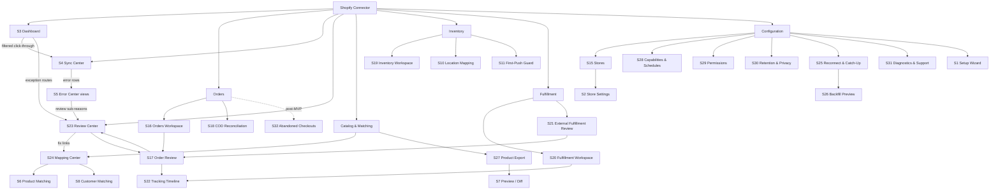

# Premium UX Master Specification

> **Signed implementation delta (2026-08-02).** The product owner approved
> [the C1–C8 UI-restructure contract](ui-restructure-design-contract-2026-08-02.md).
> [The dated implementation delta](premium-ux-ui-restructure-delta-2026-08-02.md)
> is therefore authoritative wherever this earlier proposal conflicts with the
> four-pillar navigation, two-dashboard split, five onboarding phases,
> acknowledgement ladder, or recoverable fulfillment-mode transition. The
> historical screen inventory below remains useful only for component and flow
> provenance; it is not the implementation navigation target.

> **Status: Proposed — Fable gap-closure mission, 2026-07-16.** The premium UX
> master specification: single coherent information architecture for the whole
> connector under the two-role model. Builds on the accepted design system
> ([../03-architecture/premium-ui-ux-design-system.md](../03-architecture/premium-ui-ux-design-system.md))
> and the accepted U0 prototype baseline ([../09-ui-prototype/](../09-ui-prototype/));
> supersedes, at proposal level, the four-role permission lines and
> S1–S14-only inventory of
> [ui-ux-final-design-spec.md](ui-ux-final-design-spec.md) /
> [screen-inventory-and-navigation-map.md](screen-inventory-and-navigation-map.md)
> (accepted docs not rewritten). Acceptance authority: product owner + Claude
> control room. No implementation authorized; feeds UI packets U1–U3 (Wave 5).

---

## 0. Scope and reading guide

This document is the one place where the whole product's UX hangs together:
principles (§1), information architecture and navigation (§2), per-screen
specifications (§3), the global state contract (§4), motion/3D/microcopy/
density policy (§5), prototype mapping (§6), and implementation phasing (§7).
Everything here is **[Design proposal]** unless labelled otherwise; badge and
status vocabularies are imported, not reinvented, from
[shopify-fulfillment-status-model.md](shopify-fulfillment-status-model.md) §9
and [sales-order-lifecycle-and-confirmation-policy.md](sales-order-lifecycle-and-confirmation-policy.md)
§2.1. Roles throughout are exactly **Connector User** ("User") and
**Connector Administrator** ("Administrator") per
[connector-roles-and-permissions.md](connector-roles-and-permissions.md).

## 1. Design principles

### 1.1 Evidence-grounded principles

1. **Native-feel is the premium** — [Fact, competitor refresh §8, S18/S19]
   Shopify's own Polaris guidance is that app components "work like native
   HTML elements" and ensure apps "look and behave like the rest of the
   Shopify admin", built on tokens ("coded names that represent design
   decisions for color, spacing, typography, and more"). [Recommendation]
   We mirror that posture inside Odoo: the connector must feel like the best
   screens in the customer's Odoo — token-driven, one status vocabulary,
   designed empty states, skeletons — never a foreign app (design-system law 4).
2. **Transactional error UX, not log files** — [Documented workflow — Partial,
   competitor refresh §8, S20] Celigo's bar is "real-time dashboards,
   transactional error tracking, automatic retries, and detailed error logs"
   with classify/resolve/retry workflows. [Inference] The premium bar is a
   per-record error object with classification, one-click retry where the
   taxonomy allows, resolution audit — every error screen in §3 is specified
   against that bar, and against the market whitespace evidence (refresh §9:
   duplicate orders, debug-only logs, cron-only sync are the incumbent
   failure modes we must visibly out-class).
3. **WCAG 2.2 AA as acceptance gates, not aspirations** — [Fact, refresh §8,
   S21] SC 1.4.3 contrast ≥ 4.5:1 (large ≥ 3:1), 1.4.11 non-text ≥ 3:1,
   1.4.13 hover/focus content rules, 2.4.7 focus visible, 2.4.11 Focus Not
   Obscured, 2.5.8 Target Size (24×24 CSS px). Every screen spec in §3
   inherits the design system's §12 accessibility criteria and §13 checklist.
4. **The five laws** — [Accepted-proposal basis, design system §1] every
   surface obeys: one dominant answer; calm by default, loud only when true;
   text first, color reinforces; Odoo-native is a feature; nothing vanity.

### 1.2 The Apple × enterprise synthesis (binding visual direction)

**[Proposed product decision PD-UX-1 — product-owner binding direction,
2026-07-16]** The connector is a **visually distinctive, premium,
Odoo-integrated product** with Apple-level clarity, polish, restraint,
smoothness, hierarchy, and detail. "Odoo-integrated" does **not** mean
limited to standard Odoo forms, colors, and layouts: standard Odoo is the
technical foundation, not the visual ceiling.

**Permitted premium vocabulary** (each within PD-7's selective-Owl
boundaries, §7): custom Owl dashboards and workspaces; premium cards and
command-center layouts; refined typography and spacing (design-system §4
scales only); purposeful branded colors and gradients where appropriate;
premium iconography (§7 catalogue); data visualizations; controlled shadows
and depth (overlay-only elevation); smooth state transitions; skeleton
loading; interactive mapping workflows; visual sync timelines; polished
drawers, modals, and side panels; contextual illustrations; tasteful motion;
tasteful **3D graphics only** in onboarding/welcome/connection-success/
education/empty states (§5.2); responsive desktop + tablet; accessible
contrast, focus, keyboard, and reduced-motion behavior.

**Hard boundary:** operational and error screens stay calm, legible, and
fast. Decorative graphics never obscure failures, quantities, payments,
stock, or required actions.

**The synthesis:** Apple-inspired qualities — simplicity, hierarchy,
confidence, calm, smoothness, restraint, excellent microcopy, coherent
motion, premium perceived quality — combined with enterprise/Odoo qualities
— filters, bulk actions, traceability, audit history, keyboard efficiency,
density when needed, record linking, granular security, and large-dataset
performance. Neither wins alone: a screen that is beautiful but cannot batch
500 rows fails, and a dense grid with no lead answer fails. **One coherent
product — no persona-split dashboards or apps** (single-surface,
affordance-gated model retained from the accepted corpus; only the role
count changes to two).

## 2. Information architecture

The current implementation information architecture is the locked four-pillar
tree in
[premium-ux-ui-restructure-delta-2026-08-02.md](premium-ux-ui-restructure-delta-2026-08-02.md)
§2. Sections 2.1–2.4 below preserve the superseded 2026-07-16 proposal for
traceability and must not be used to retain Dashboard / Sync Center / Error
Center / Catalog & Matching as peer navigation entries.

### 2.1 One navigation model (extends the accepted 7-menu structure)

The accepted seven top-level entries (Dashboard, Sync Center, Error Center,
Catalog & Matching, Inventory, Fulfillment, Configuration) remain and keep
their meaning; this spec **extends** them — it adds one new top-level entry
(**Orders**) mandated by the new order/COD/fulfillment product docs, and
grows existing branches. Continuity rule: no accepted surface is removed or
renamed; new surfaces slot beneath existing entries wherever the mental model
allows.

```
Shopify Connector
├── Dashboard                          S3   — the home; ranked hierarchy (design system §9)
├── Orders                                  — NEW top-level (order-first merchants)
│   ├── Orders Workspace               S16
│   ├── Order Review                   S17  (drill-in, not a menu item)
│   ├── COD Reconciliation             S18
│   └── Abandoned Checkouts            S32  (post-MVP placeholder — no menu stub until enabled)
├── Sync Center                        S4   — jobs list + job form (S4 detail)
├── Review Center                      S23  — unified manual-review center (absorbs Error Center's
│                                             review queue; Error Center recovery views remain S5)
├── Catalog & Matching
│   ├── Mapping Center                 S24  (unified; hosts S6 product / S8 customer matching)
│   ├── Product Export                 S27
│   └── Product Preview / Diff         S7   (in-flow, not a menu item)
├── Inventory
│   ├── Inventory Workspace            S19
│   ├── Location Mapping               S10
│   └── First-Push & Apply Queue       S11 / S12-flow
├── Fulfillment
│   ├── Fulfillment Workspace          S20
│   ├── External Fulfillment Review    S21
│   └── Tracking Timeline              S22  (drill-in from order/fulfillment rows)
└── Configuration                            — Administrator-focused branch of the same surface
    ├── Stores                         S15  (list → store detail; hosts S2 store settings)
    ├── Settings — Capabilities & Schedules  S28
    ├── Permissions (two-role)         S29  (supersedes S14 content)
    ├── Retention & Privacy            S30
    ├── Reconnect & Catch-Up           S25  (+ Backfill Preview S26 drill-in)
    ├── Diagnostics & Support          S31
    └── Setup Wizard                   S1   (re-runnable; hidden from Users)
```

Design smells watched: any branch exceeding ~4 children; any "coming soon"
menu stub (anti-premium — S32 gets no menu entry until the capability is
enabled by an Administrator).

### 2.2 Full screen inventory (S1–S14 kept, S15+ added)

| # | Screen | Status vs accepted inventory | MVP / Later |
| --- | --- | --- | --- |
| S1 | Setup wizard (11 steps, incl. credential + readiness steps) | Accepted, unchanged | MVP |
| S2 | Store settings form | Accepted; now the detail body of S15 | MVP |
| S3 | Dashboard / command center | Accepted; §9 ranked hierarchy | MVP |
| S4 | Sync center (jobs list + job form + logs) | Accepted, unchanged | MVP |
| S5 | Error center / recovery | Accepted; review queue moves to S23 | MVP |
| S6 | Product matching center | Accepted; hosted inside S24 | MVP |
| S7 | Product preview / diff | Accepted, unchanged | MVP |
| S8 | Customer matching / review | Accepted; hosted inside S24 | MVP |
| S9 | Order-import touchpoints (no dedicated screen) | Accepted; now feed S16/S17/S23 | MVP |
| S10 | Location mapping | Accepted, unchanged | MVP |
| S11 | Inventory first-push guard | Accepted, unchanged | MVP |
| S12 | Inventory settings + apply queue | Accepted; workspace face is S19 | MVP |
| S13 | Fulfillment log/detail extensions | Accepted; workspace face is S20 | MVP |
| S14 | Roles & access (four-role informational) | **Superseded at proposal level by S29** | — |
| S15 | Store list & store detail | New | MVP |
| S16 | Orders workspace | New | MVP |
| S17 | Order review (single order) | New | MVP |
| S18 | COD reconciliation workspace | New | MVP |
| S19 | Inventory workspace | New | MVP |
| S20 | Fulfillment workspace | New | MVP |
| S21 | External fulfillment review | New | MVP |
| S22 | Tracking timeline | New | MVP |
| S23 | Manual review center (unified) | New (absorbs S5 review queue) | MVP |
| S24 | Mapping center (unified shell for S6/S8/S10 links) | New | MVP |
| S25 | Reconnect & catch-up | New | MVP |
| S26 | Backfill preview | New | MVP |
| S27 | Product export workspace | New | MVP |
| S28 | Settings — capabilities & schedules | New | MVP |
| S29 | Permissions (two-role) | New (supersedes S14) | MVP |
| S30 | Retention & privacy | New | MVP |
| S31 | Diagnostics & support | New | MVP |
| S32 | Abandoned checkouts workspace | New | **Post-MVP placeholder** |

### 2.3 Navigation map



Every dashboard count, badge, and exception entry click-throughs to a
filtered list ("no dead end" contract, accepted, retained). Odoo records
(product / sale order / partner / picking) keep bidirectional smart buttons
into bindings, jobs, and last errors.

### 2.4 Role visibility (navigation level — two roles only)

Visibility is shared; **actions** are gated server-side. "act" = full
permitted actions per [connector-roles-and-permissions.md](connector-roles-and-permissions.md) §1.

| Menu entry / screen | Connector User | Connector Administrator |
| --- | --- | --- |
| Dashboard (S3) | act (quick actions) | act |
| Orders workspace / Order review (S16/S17) | act (inspect, resolve ordinary exceptions) | act |
| COD reconciliation (S18) | act (operational review/confirmation; no posting) | act (+ posting/config) |
| Sync Center (S4) | act (retry/cancel eligible jobs) | act |
| Review Center (S23) | act (six ordinary sub-reasons) | act (+ destructive overrides) |
| Mapping Center (S24: S6/S8) | act (ordinary matching, bindings) | act (+ exceptional overrides) |
| Product Export (S27) + Diff (S7) | act (permitted export/preview flows) | act |
| Inventory workspace (S19) / apply queue | act (inspect, verification reads, permitted applies) | act |
| Location mapping (S10) | read | act |
| First-push guard (S11) | stage; confirm where store policy allows | act (admin-tier confirmations) |
| Fulfillment workspace (S20) / External review (S21) / Timeline (S22) | act (reconcile per store policy, notification guards) | act (+ mode selection) |
| Stores (S15) / Store settings (S2) | read (credentials always masked) | act |
| Capabilities & schedules (S28) | read | act |
| Permissions (S29) | read (own role visible) | act |
| Retention & privacy (S30) | read | act |
| Reconnect & catch-up (S25) | read progress; run permitted verification | act (initiate reconnect/backfill) |
| Backfill preview (S26) | read | act |
| Diagnostics & support (S31) | act (role-appropriate diagnostics) | act (full, incl. raw payloads) |
| Abandoned checkouts (S32, post-MVP) | act if enabled (PII per policy) | act |
| Setup wizard (S1) | hidden | act |

## 3. Per-screen specifications

Template fields per screen: **Purpose · Primary role · Data · Primary
action · Secondary · Permissions · Hierarchy · Status language · Visual ·
Filters · Bulk · States (empty/loading/success/error/review) · A11y ·
Performance · Responsive · Odoo links · Audit.** Global state visuals and
copy come from §4 (referenced, not repeated); every screen inherits the
design-system §12 accessibility gates and §13 checklist; "PB" = performance
budgets. Screens are specified compactly; anything unstated follows the
design system defaults.

### S1 — Setup wizard

- **Purpose:** first-run and re-runnable guided setup (11 accepted steps: store, credentials, scopes, test connection, readiness, policies, mappings, schedule, review, finish). **Primary role:** Administrator only (hidden from Users).
- **Data:** step state, credential entry (write-only), readiness check results, policy choices (order confirmation P1/P2/P3, fulfillment mode 1/2, COD policy), schedule defaults.
- **Primary action:** Continue (per step). **Secondary:** Back, Save & exit (resumes later), re-run readiness.
- **Hierarchy:** one question per step; step title 1.375 rem; the wizard chrome is a PD-7 Owl surface.
- **Status language:** readiness results use success/warning/danger badges with per-check fix links.
- **Visual:** premium wizard chrome; this is a sanctioned home for contextual illustration and tasteful 3D (welcome step, connection-success step) — never on the credential or readiness steps. Policy choices render as radio cards with one-line consequences ("Reserve stock only for captured payments — recommended").
- **States:** loading = per-check skeleton rows during readiness; error = per-check reason + fix + owner; success = connection-success moment (see §5.2) then hard handoff to S3.
- **A11y:** full keyboard step traversal; focus moves to step heading on advance; 3D/illustration assets are decorative (`aria-hidden`), reduced-motion swaps to static.
- **Performance:** readiness checks stream results per check (no all-or-nothing spinner). **Responsive:** single column at 768 px. **Audit:** every durable choice persisted on store/settings records; re-run resumes.

### S2 / S15 — Store list & store detail (store settings)

- **Purpose:** S15 lists connected stores with health at a glance; S2 (the detail body) is the full per-store settings form. **Primary role:** Administrator (Users read).
- **Data:** store name/domain, connection state (connected / reconnecting / disconnected / paused), API version, last successful sync per domain, capability toggles summary, watermark freshness.
- **Primary action:** open store detail (list); Save (detail). **Secondary:** Reconnect (routes to S25), pause, disconnect (danger, consequence preview per DEC-030), re-run readiness.
- **Permissions:** all config edits Administrator; credentials write-only for everyone (no read-back, DEC-004).
- **Hierarchy:** list = one card per store with a lead health sentence; detail = status band → grouped settings → notebook tabs (domains extend via the accepted settings-extension seam).
- **Status language:** connection badges (success/warning/danger/info); per-domain freshness lines ("Inventory: synced 4 min ago").
- **Visual:** premium store cards (single card style, no nested cards); the status band is the lead answer band.
- **Filters:** none needed at MVP (single store; multi-store-safe layout). **Bulk:** none.
- **States:** empty = "Connect your store to begin" + one action (wizard); offline/reconnecting per §4; error band names the failing check with fix link.
- **A11y:** status band is a live region on state change (≥ 30 s cadence). **Performance:** aggregates only (PB-10). **Responsive:** cards stack. **Odoo links:** company/warehouse records. **Audit:** settings changes tracked (who/when/what) in chatter.

### S3 — Dashboard / command center

- **Purpose:** the answer to "is everything fine, and if not, what do I do first?" **Primary role:** both; quick actions gated.
- **Data & hierarchy (design system §9, binding):** (1) lead answer band — "All systems normal" / "3 items need your attention", 1.75 rem; (2) primary exception region — ≤ 3 entries (needs-review, permanently failed, connection/overdue), each sentence + count + one action to the filtered S23/S4 view; (3) quiet stat-chip row — per-domain last-sync, retry-waiting, first-push-pending, inventory/fulfillment/matching/order/COD exception counts; (4) recent-activity timeline + honest-freshness line ("Checked every 5 min"); (5) optional single 7-day sparkline (severable).
- **Primary action:** the one action in the band/exception entries. **Secondary:** chip click-throughs.
- **Status language:** §4 vocabulary only; severity never downgrades by roll-up.
- **Visual:** the flagship PD-7 Owl surface — premium command-center layout; no nine-equal-tiles grid; no vanity metrics.
- **States:** empty (pre-setup) = guided empty state (illustration permitted) with "Set up your store"; loading = skeleton band + chip skeletons; stale/delayed per §4 (freshness line escalates to warning).
- **A11y:** auto-refresh pausable, ≥ 30 s (PB-12, WCAG 2.2.2); band changes announced politely. **Performance:** one aggregate endpoint, `read_group`/counts only (PB-10). **Responsive:** stacks band → exceptions → chips → activity; no horizontal scroll. **Audit:** timeline entries link to their jobs/records.

### S4 — Sync center (jobs list, job form, logs)

- **Purpose:** "what ran" — monitoring, never merged with deciding (RA-013). **Primary role:** both.
- **Data:** job rows: domain, direction, plain-word state (10 accepted states), store, created/finished, attempt count, next retry time; form adds statusbar, logs notebook, technical detail behind disclosure.
- **Primary action:** open row. **Secondary:** Retry / Cancel on eligible rows (server-side error-class-gated, both roles), export job report.
- **Hierarchy:** default filter "needs attention"; dense Odoo-native list one click below the calm summary chip row.
- **Status language:** job-state → semantic-status mapping table (design system §6), one mapping, no per-screen invention.
- **Visual:** standard Odoo list/form (PD-7: large tables stay native); premium touches = badge chips, honest relative timestamps with absolute on hover (1.4.13-compliant tooltip).
- **Filters:** state, domain, store, date, "needs attention", "retry waiting". **Bulk:** retry eligible / cancel queued (selection-scoped, confirmation with count).
- **States:** empty = affirmative ("Nothing has needed to run yet" or "All quiet — last job 12 min ago"); loading = native list skeleton; error rows route to S5/S23.
- **A11y:** row state = badge text + icon, never color alone. **Performance:** server pagination (PB-9); no unbounded recordsets. **Responsive:** optional-column hiding; state + identifier visible at 360 px. **Odoo links:** source record smart-links per row. **Audit:** job logs read-only for all roles; full attempt history on the form.

### S5 — Error center (recovery views)

- **Purpose:** "what needs fixing" — recovery surface for failed jobs, with the two accepted order-import touchpoints (S9) as embedded extensions; **review-decision items live in S23** (cross-linked both ways).
- **Primary role:** both (fix/retry). **Data:** error entries: classification, reason + fix + owner in words, affected record, attempt history, financial-mismatch inline breakdown (lines/tax/shipping/discount — embedded, no navigation).
- **Primary action:** the suggested fix (deep link: mapping missing → S24; location missing → S10; readiness failure → its fixing surface). **Secondary:** Retry (taxonomy-gated), Verify current state (verification read before retry), acknowledge.
- **Status language:** danger for failed/blocked; warning for retry-waiting; §4 unknown-schema entries appear here as warnings.
- **Visual:** entry cards lead with the sentence, not the code; technical detail behind one disclosure; never a raw stack trace on the primary surface.
- **Filters:** classification, domain, store, age. **Bulk:** retry-eligible only, never bulk-acknowledge failures silently.
- **States:** empty = affirmative "Nothing needs fixing."; manual-review items render a hand-off chip to S23 (visually distinct, warning family).
- **A11y/Performance/Responsive:** as S4. **Audit:** every retry/acknowledge recorded who/when/what (DEC-009).

### S6 — Product matching (inside S24)

- **Purpose:** decide product identity — approve/decline match candidates, create bindings; duplicate prevention front door (RA-006: no name-only auto-match).
- **Primary role:** User (act). **Data:** unmatched Shopify products/variants, candidate evidence cards (SKU/barcode/name signals with per-signal confidence), existing binding state.
- **Primary action:** Confirm match (per candidate). **Secondary:** Create as new (routes through preview), skip/defer, open S7 diff.
- **Hierarchy:** one item under decision at a time (focused deciding), queue list beside/below; PD-7 Owl surface.
- **Visual:** interactive mapping workflow — evidence cards, side-by-side fields, decision bar; blocking preview dialog before commit (accepted).
- **Filters:** confidence, domain (product/variant), store. **Bulk:** confirm exact-identifier (SKU/barcode) matches only, with preview count; never bulk name-match.
- **States:** empty = "Every product is matched."; error = binding write failure with retry; review = ambiguous candidates flagged.
- **A11y:** full keyboard decide flow (approve/decline/skip reachable without pointer). **Performance:** candidate pages bounded (PB-10). **Odoo links:** product template/variant records. **Audit:** every match/decline recorded with evidence snapshot.

### S7 — Product preview / diff

- **Purpose:** review a write before it happens — field-level diff of what export/update will change (five accepted preview states + destructive-write diff). **Primary role:** User.
- **Data:** field-by-field current vs proposed values, ownership per field (field-ownership matrix, [product-export-operating-model.md](product-export-operating-model.md) §2), media changes, price changes, publication state change.
- **Primary action:** Confirm & queue (enqueue-only semantics, PB-1). **Secondary:** cancel; exclude specific fields where policy allows.
- **Status language:** changed/added/removed/conflict chips; conflicts (changed-since-read) escalate to warning with re-read action.
- **Visual:** PD-7 Owl diff rendering — aligned columns, changed values highlighted by weight + icon + text (never color alone); destructive changes danger-styled with consequence sentence.
- **States:** loading = field-row skeletons; error = read failure with retry; review = conflict state blocks confirm until re-read.
- **A11y:** diff semantics conveyed in text ("was X, will be Y"). **Performance:** single bounded read per preview. **Audit:** confirmed previews persist the diff snapshot as evidence.

### S8 — Customer matching / review (inside S24)

- As S6, for customers/partners: candidate evidence = email/phone/address signals; **both Connector User and Connector Administrator read the raw operational PII** their permitted operations require — there is no masked-by-default view and no unmask toggle in the MVP ([connector-roles-and-permissions.md](connector-roles-and-permissions.md) §3); access stays governed by ordinary Odoo ACLs, company boundaries, and audit/redaction rules. Duplicate-contact prevention is the headline (top market complaint, refresh §9). Audit as S6.

### S10 — Location mapping

- **Purpose:** map Shopify locations ↔ Odoo internal locations. **Primary role:** Administrator (Users read).
- **Data:** editable list: Shopify location, mapped Odoo location (domain-filtered Many2one, internal only), state (mapped/unmapped/retired-remote).
- **Primary action:** save mapping row. **Secondary:** open readiness check, view affected inventory rows (S19 filtered).
- **Status language:** unmapped = warning; retired-remote location with live mapping = danger.
- **States:** empty = guided ("Map your first location so inventory can sync"); error rows name the consequence ("Inventory for this location is paused").
- **Visual:** native editable list; a small mapping-coverage stat chip row above. **A11y/Perf:** native list rules. **Audit:** mapping changes tracked; fix-links from error center land here filtered.

### S11 — Inventory first-push guard

- **Purpose:** the one-time ceremonial confirmation before the first stock push per mapped pair (RA-008: no blind first push) — deliberately distinct in tone from the routine apply queue.
- **Primary role:** User stages; confirmation tier per guard classification (admin-tier confirmations stay Administrator).
- **Data:** preview list per mapped pair: product, Odoo quantity, Shopify current, delta, binding state.
- **Primary action:** Confirm push (per scope; consequence preview with counts). **Secondary:** exclude rows, export preview.
- **Visual:** guarded preview→confirm wizard; the confirmation moment is allowed weight (this is where ceremony is honest, not vanity).
- **States:** loading = streamed preview build with progress text; error = per-row read failures listed, confirm blocked; success = "Queued — checked every 5 min" honesty line.
- **Performance:** preview built in bounded batches; large catalogs stream (PB budgets; [inventory-operating-model.md](inventory-operating-model.md) §9). **Audit:** confirmation record persisted (who/scope/counts).

### S12 / S19 — Inventory workspace (+ settings + apply queue)

- **Purpose:** S19 is the day-to-day inventory face: sync state, drift, review-then-apply queue; S12 settings (source-of-truth, quantity basis, apply policy) remain a Store Settings sub-surface.
- **Primary role:** User (inspect, verification reads, permitted applies); Administrator (settings).
- **Data:** lead freshness answer ("Inventory in sync — last push 3 min ago"); pending-apply queue (product, location, Odoo qty, Shopify qty, delta, cause); drift/discrepancy list; uncertainty-after-mutation flags; CAS-conflict entries.
- **Primary action:** Apply (review-then-apply row/batch, where store policy allows). **Secondary:** Verify now (verification read), open product binding, exclude.
- **Status language:** in-sync (success) / pending (info) / uncertain (warning, "verifying") / conflict (danger); coalescing surfaced honestly ("3 changes coalesced — latest value wins").
- **Visual:** calm summary band + chips over a native dense queue list; sparkline of push volume optional (severable).
- **Filters:** location, delta direction, cause, age. **Bulk:** apply selected (bounded batch, count-confirmed).
- **States:** empty = "No pending inventory changes."; partial per §4 (batch partially applied — remaining listed); stale = freshness line escalates.
- **Performance:** server pagination; large-catalog budgets ([inventory-operating-model.md](inventory-operating-model.md) §9). **Odoo links:** product + location + quant views. **Audit:** every apply recorded with before/after quantities.

### S13 / S20 — Fulfillment workspace

- **Purpose:** the fulfillment face for both modes ([fulfillment-operating-modes.md](fulfillment-operating-modes.md)): Mode 1 outbound write-back state; Mode 2 inbound reconciliation overview; notification-guard prompts (RA-009).
- **Primary role:** User. **Data:** fulfillment rows keyed to the distinct status dimensions of the four-layer status taxonomy ([shopify-fulfillment-status-model.md](shopify-fulfillment-status-model.md) §1) — Odoo delivery state, order fulfillment summary (Layer A), FO work state (incl. hold reasons), fulfillment result, carrier milestone, and connector reconciliation state (Layer C) — **one badge per dimension, never merged**.
- **Primary action:** open the row's pending decision (notification guard / review case / timeline). **Secondary:** verify state, open picking, open S22 timeline.
- **Status language:** exactly the §2–§5 label/badge/severity tables of the fulfillment status model, including deprecated-value tooltips and the unknown-value contract (§4.11 here).
- **Visual:** concept badges in a fixed column order; row severity = max across concepts; Delivered-inconsistency cases (status model §8) pinned at top, danger badge `alert-decagram`, also pinned to S3.
- **Filters:** mode, concept states, store, hold reason, age. **Bulk:** acknowledge residual informational cases only; never bulk-resolve mismatches.
- **States:** empty = "All fulfillments reconciled."; review = mismatch cases inline with decision affordances.
- **Performance:** native paginated lists; milestone timelines lazy-load in S22. **Odoo links:** pickings, sale orders. **Audit:** notification decisions and reconciliations recorded.

### S16 — Orders workspace

- **Purpose:** every imported order's commercial + financial + fulfillment + connector state in one ranked list — the merchant's "are my orders flowing?" answer.
- **Primary role:** User. **Data:** order rows: Shopify order name, financial-status badge ([sales-order-lifecycle...](sales-order-lifecycle-and-confirmation-policy.md) §2.1 badge column: Paid/green, Authorized/blue, Payment pending/grey, Partially paid/amber, Refunded-Voided-Expired/red), confirmation-policy outcome (SO / quotation / waiting / skipped+review), fulfillment summary badge, COD flag, connector binding state, exceptions count.
- **Primary action:** open S17 order review. **Secondary:** re-scan waiting orders (verification read), open Odoo sale order.
- **Hierarchy:** lead band = "All orders imported and consistent" / "N orders need attention"; exception chips (wait-state, review-required, financial-mismatch, duplicates-prevented count as a trust signal).
- **Visual:** native list under a calm Owl-free chip header (chips are shared components); wait-state rows quiet grey, never alarming (waiting is normal).
- **Filters:** financial state, policy outcome, COD, store, date, "needs attention". **Bulk:** re-scan waiting; nothing destructive.
- **States:** empty = "No orders imported yet — orders appear here within minutes of your first sync."; partial = backfill-in-progress banner with progress (links S26).
- **Performance:** server pagination; PB list budgets. **Odoo links:** sale order, partner, invoice smart-links. **Audit:** import decisions (policy, skip reasons) visible per row detail.

### S17 — Order review (single order)

- **Purpose:** the complete cross-system truth for one order without opening Shopify.
- **Primary role:** User. **Data:** four state strips (accepted §8 UX summary of the order-lifecycle doc): Shopify financial status, fulfillment status, cancellation status, connector status (bound / wait / hold reason); line-level table (ordered/fulfilled/refund-flagged quantities); financial consistency panel (totals breakdown: lines/tax/shipping/discount, pass/fail); binding + duplicate-prevention evidence; COD panel when applicable (three-dimension states, links S18); fulfillment cases (links S20/S21/S22).
- **Primary action:** the order's single pending decision if any (resolve review case / confirm quotation where policy allows). **Secondary:** re-scan, open Odoo SO, view raw payload (Administrator).
- **Hierarchy:** lead band = one sentence ("Consistent — paid, confirmed, fully shipped" / "Needs a decision: partially paid"); strips; detail below.
- **Status language:** financial badges §2.1; fulfillment badges status-model tables; connector states per §4.
- **Visual:** premium record header (Owl strip band permitted as a shared component) over a native form; internal tokens never primary (MBQ-22).
- **States:** review = decision affordance inline with consequence sentence; error = consistency-gate failure with the exact mismatched component highlighted.
- **A11y:** strips are text badges; totals table keeps header associations. **Performance:** one bounded read + lazy panels. **Odoo links:** SO, pickings, invoices, partner. **Audit:** full decision history in chatter.

### S18 — COD reconciliation workspace

- **Purpose:** operate the COD lifecycle ([cod-lifecycle-and-reconciliation.md](cod-lifecycle-and-reconciliation.md)): see every COD order's three-dimension state, work discrepancies, confirm collected/uncollected evidence. The market has no documented COD UX (refresh §9 whitespace 1) — this screen is a flagship differentiator and must stay operationally calm.
- **Primary role:** User (operational review/confirmation per store policy; **no accounting posting** — posting/config is Administrator).
- **Data:** COD rows: commercial state, fulfillment state, collection state (three badges, one per dimension); value ledger summary (due vs collected vs discrepancy); scenario tag (the 16 mandated scenarios); RTO/return flags.
- **Primary action:** record/confirm collection evidence (audited). **Secondary:** open ledger detail, mark discrepancy reviewed, open S17.
- **Hierarchy:** lead band = "Collections consistent" / "N discrepancies"; discrepancy region first; routine rows below.
- **Status language:** dimension states verbatim from the COD doc §2 (`fully-collected` → success; `partially-collected`/`discrepancy` → warning/danger; `refunded` → neutral-red per financial badges).
- **Filters:** collection state, scenario, courier/store, age. **Bulk:** confirm courier-remittance batches (count + total preview, Administrator-tier when it triggers posting).
- **States:** empty = "No cash-on-delivery orders awaiting reconciliation."; partial = remittance batch partially matched, remainder listed.
- **A11y:** currency values with tabular figures; discrepancy rows announced. **Performance:** ledger aggregates server-side. **Odoo links:** SO, picking, (Administrator) payment records. **Audit:** every collection confirmation who/when/amount/evidence-source.

### S21 — External fulfillment review

- **Purpose:** review inbound/externally-created fulfillments (Mode 2, and Mode 1 external-origin detections) against Odoo pickings before anything applies ([fulfillment-operating-modes.md](fulfillment-operating-modes.md) §3–§5).
- **Primary role:** User. **Data:** review cases: Shopify fulfillment evidence (lines, quantities, location, tracking), the deterministic picking-selection result, per-condition checklist outcome (Mode 2 exact-conditions), mismatch details (quantity/location/line).
- **Primary action:** Validate proposal (Mode 1 explicit validation) / Apply (Mode 2 only when checklist fully passes). **Secondary:** correct linkage, acknowledge with reason, reject.
- **Hierarchy:** one case at a time (focused deciding, like S6); checklist rendered as pass/fail rows — every failed condition in words.
- **Status language:** reconciliation states (`observed`, `review`, `acknowledged`, `applied`, `superseded`) + fulfillment-result badges. *(TD-003, corrected: these are the five real `RECONCILED_STATE_SELECTION` values. `under_review`, `auto_matched` and `rejected` were never selection values — the code uses `review`, has no automatic-match state, and records a rejected case as `acknowledged`. Authoritative mapping: [`connector-vocabulary-reconciliation.md`](../06-prompts/connector-vocabulary-reconciliation.md).)*
- **States:** empty = "No external fulfillments awaiting review."; unknown-schema per §4.11 halts auto-apply and surfaces here.
- **A11y:** checklist rows text+icon. **Performance:** case detail lazy-loads evidence payload. **Odoo links:** picking, SO. **Audit:** decision + evidence snapshot persisted; nothing auto-changes Odoo stock outside the checklist (D-014-8).

### S22 — Tracking timeline

- **Purpose:** the visual sync/parcel timeline for one fulfillment: connector events + carrier milestones in one chronological view — informational only (a milestone never mutates stock or reconciliation state; status model §8).
- **Primary role:** both (read). **Data:** ordered events: connector actions (created, sent, reconciled), the 11 carrier milestones with labels/badges (status model §5), tracking company/number/URL, in-transit/delivered/estimated timestamps.
- **Primary action:** none required (informational); Delivered-inconsistency banner links its review case. **Secondary:** open carrier tracking URL, copy tracking number.
- **Visual:** a premium vertical timeline (shared Owl component candidate) — milestone dots colored by severity with text labels; smooth reveal transitions (§5.1); calm.
- **States:** empty = "No tracking events yet."; delayed = `DELAYED` milestone renders the §4 delayed pattern; unknown milestone = "Unknown milestone (RAW_VALUE)" warning row.
- **A11y:** timeline is an ordered list semantically; times localized with absolute values. **Performance:** milestones paginate beyond 50. **Audit:** raw event payload behind Administrator disclosure.

### S23 — Manual review center (unified)

- **Purpose:** the single queue of everything waiting on a human decision — the six accepted manual-review sub-reasons, order wait/approval items, fulfillment mismatch cases, export conflicts, COD discrepancies — unified so "what needs me?" has one answer (extends the accepted Error-Center review queue; monitoring stays S4, fixing stays S5).
- **Primary role:** User (ordinary resolutions); Administrator (destructive variants).
- **Data:** review items: sub-reason, domain, affected record, waiting-since, suggested resolution, decision affordances inline.
- **Primary action:** the item's resolution (approve / match / validate / acknowledge — each with consequence sentence). **Secondary:** route to the specialist screen (S6/S8/S17/S18/S21), assign via activity.
- **Hierarchy:** lead band = "Nothing is waiting on you" / "N decisions waiting, oldest 2 days"; grouped by sub-reason; `hand` icon, warning family — visually distinct from errors (design system §11).
- **Filters:** sub-reason, domain, age, store. **Bulk:** only same-sub-reason homogeneous batches with per-item preview; destructive never bulk.
- **States:** empty = affirmative; loading = grouped skeletons; every resolution shows quiet success confirmation.
- **A11y:** decision buttons ≥ 24 px targets; keyboard-first triage (j/k-style row traversal is a candidate, Open question OQ-UX-4). **Performance:** paginated groups. **Audit:** who/when/what on every resolution (DEC-009) — the audit trail is visible on the item itself.

### S24 — Mapping center

- **Purpose:** one roof for "make data agree": hosts product matching (S6), customer matching (S8), and links to location mapping (S10) and export exceptions (S27) — a shell with a coverage overview, not a new decision surface.
- **Data:** coverage stats per domain (matched %, pending counts), entry cards into each matching flow.
- **Primary action:** enter the flow with the largest pending queue. **States:** empty = "Everything is mapped." with coverage summary. Other behavior per hosted screens.

### S25 — Reconnect & catch-up

- **Purpose:** run and observe the eight-step reconnect sequence and per-domain catch-up ([reconnect-catchup-backfill-policy.md](reconnect-catchup-backfill-policy.md) §2–§4): watermarks, overlap windows, gap reports.
- **Primary role:** Administrator initiates (credential-adjacent); Users view progress and run permitted verification.
- **Data:** disconnection summary (when, how long, what happened meanwhile); per-domain watermark table (last cursor, overlap window, catch-up state); step progress; gap report.
- **Primary action:** Start reconnect (Administrator; consequence preview: domains, windows, estimated volume). **Secondary:** open backfill preview (S26), export gap report, verify a domain.
- **Hierarchy:** reconnect is a guided, sequential experience — step list with live states (§4 reconnecting pattern), then a completion summary ("Caught up: 214 orders scanned, 3 need review").
- **Status language:** per-domain: caught-up (success) / catching-up (info) / gap-found (warning) / blocked (danger).
- **States:** loading = step skeletons then streamed progress; partial = some domains caught up, others pending — never a single merged spinner; success = summary with review-item links.
- **A11y:** progress announced at step boundaries, pausable live region. **Performance:** progress via bounded polls, honest cadence text. **Audit:** every reconnect run persisted with its gap report.

### S26 — Backfill preview

- **Purpose:** preview-first, Administrator-controlled historical order backfill (policy doc §5): show exactly what a date-range import would do before anything is enqueued — the duplicate-safe re-import nobody in the market documents (refresh §9 whitespace 5).
- **Primary role:** Administrator. **Data:** date range picker; preview result: total found, already-imported (skipped by binding), would-import, would-need-review (financial states), estimated volume/time.
- **Primary action:** Confirm backfill (enqueue-only; consequence sentence with exact counts). **Secondary:** adjust range and re-preview, export preview list.
- **States:** loading = preview build with streamed counts; empty = "Nothing new in this range — all 143 orders are already imported." (a trust moment); partial = preview page-limited with "showing first N" honesty.
- **Visual:** the preview counts render as stat chips; would-import rows in a bounded list. **Performance:** preview is a bounded server computation, paginated detail. **Audit:** confirmed backfills persist the preview snapshot.

### S27 — Product export workspace

- **Purpose:** run controlled export/update flows ([product-export-operating-model.md](product-export-operating-model.md)): selection → preview (S7) → queue; watch export state and conflicts.
- **Primary role:** User (permitted flows); Administrator (policy/field-ownership settings).
- **Data:** exportable products with binding state (never-exported / exported / update-pending / conflict), field-ownership summary, media export state, publication state.
- **Primary action:** Preview & export selected (always through S7 — no blind export). **Secondary:** resolve conflict (changed-since-read → re-read + re-preview), open binding.
- **Status language:** conflict = warning ("Shopify changed since we last read — review again"); duplicate-prevention skips shown as neutral info.
- **Filters:** binding state, category, publication, media pending. **Bulk:** export selected via a single combined preview with per-product sections; cap per batch (performance budget).
- **States:** empty = "No products staged for export."; partial = batch partially queued, failures listed per product; unknown-schema halts per §4.11.
- **Performance:** media upload states streamed; large selections chunked with progress. **Odoo links:** product templates/variants. **Audit:** export decisions + diff snapshots persisted.

### S28 — Settings: capabilities & schedules

- **Purpose:** Administrator control of capability enablement (inventory, product export, fulfillment mode, COD, abandoned checkouts) and cron/interval scheduling + queue tuning.
- **Primary role:** Administrator (Users read). **Data:** capability toggles with one-line consequence each; per-domain schedule rows (interval, last run, next run, health); queue tuning values.
- **Primary action:** Save. **Secondary:** run now (enqueue-only), open the capability's workspace.
- **Status language:** schedule health (on-time / delayed / failing) uses §4 delayed pattern; honest cadence ("Runs every 10 minutes") — never "real-time" claims (checklist V-12).
- **States:** disabled capability shows a calm explainer, never a dead menu elsewhere. **Audit:** every toggle/schedule change tracked. **A11y:** toggles are labelled switches with state text.

### S29 — Permissions (two-role)

- **Purpose:** show and (Administrator) assign the two customer-facing roles; make the capability split legible. Supersedes S14's four-role informational page at proposal level.
- **Primary role:** Administrator (assign); Users see their own role and what it means.
- **Data:** user list with one "Shopify Connector" role selection (User / Administrator / none — single privilege dropdown per the roles doc §4.3); capability comparison table (User column vs Administrator column, from roles doc §1.1/§1.2). There is **no** PII visibility toggle in the MVP (roles doc §3): both roles read raw operational PII, so no masking control is shown here.
- **Primary action:** change a user's role (consequence sentence: what they gain/lose). **Secondary:** open retention & privacy (S30 cross-link).
- **Status language:** none beyond role chips; no PII-masking/visibility state is shown (the MVP has no PII toggle — roles doc §3).
- **States:** empty n/a; error = save failure with retry. **A11y:** comparison table with proper headers. **Audit:** role changes logged who/when.

### S30 — Retention & privacy

- **Purpose:** Administrator controls for data retention windows, purge-on-disconnect behavior (DEC-030), documented data-privacy/retention policy, export-before-uninstall. (No PII-masking or visibility toggle exists in the MVP — roles doc §3; a masking/privacy feature is a separately reviewed post-MVP enhancement.)
- **Primary role:** Administrator (Users read). **Data:** retention windows per data class (evidence records, logs, checkout PII per [abandoned-checkout-policy.md](abandoned-checkout-policy.md) §3.4), purge policy, last purge runs. (No per-store PII toggle — roles doc §3.)
- **Primary action:** Save. **Secondary:** run export-before-uninstall (guarded, consequence preview), view purge history.
- **Status language:** destructive actions danger-styled with preview of exactly what is deleted (counts per class) — never a bare "Purge" button.
- **States:** success = purge/export completion summary; error = partial purge listed per class (§4 partial). **Audit:** every retention change and purge run logged; this screen is itself the privacy audit surface.

### S31 — Diagnostics & support

- **Purpose:** role-appropriate diagnostics: verification reads, exportable job reports, connection tooling; Administrator adds raw payload access and connection-level tools. Replaces the market's "logs only in Debug Mode" anti-pattern (refresh §5) with a first-class, safe surface.
- **Primary role:** both; depth gated. **Data:** connection health checks (re-runnable readiness), API version + unknown-schema warnings registry (§4.11 landing place), recent job report exports, support bundle generator (sanitized — no credentials ever).
- **Primary action:** Run health check. **Secondary:** export support bundle, view schema warnings, (Administrator) open raw payload viewer.
- **Status language:** per-check success/warning/danger with fix links; schema warnings name family, raw value, store, API version, affected records (status model §7.5).
- **States:** loading = per-check streaming; empty warnings = "No unknown values seen — your mapping tables are complete."
- **A11y:** check results as labelled list. **Performance:** checks bounded and cancellable. **Audit:** bundle exports and raw-payload views logged.

### S32 — Abandoned checkouts (post-MVP placeholder)

- **Purpose:** optional premium workspace per [abandoned-checkout-policy.md](abandoned-checkout-policy.md) §3: list abandoned checkouts, classification, conversion display, audited manual quotation action. **Not built in MVP; no menu entry, no stub** until the capability is enabled and the feature is implemented under its own decision.
- **Design constraints recorded now:** contact PII is shown raw to permitted roles under ordinary Odoo access control and PCD access-logging — no masking or unmask toggle (the MVP has none; roles doc §3, [abandoned-checkout-policy.md](abandoned-checkout-policy.md) §3.2); refresh cadence honest; retention window surfaced; the manual quotation action is audited and consequence-previewed. Full spec deferred to the enabling packet.

## 4. Global state contract — the eleven states

Each state is defined **once** here — visual pattern + copy pattern + when
shown — and referenced by every screen. All copy follows §5.3 voice rules;
all visuals use design-system tokens; no state is ever conveyed by color
alone.

| # | State | Visual pattern | Copy pattern | When shown |
| --- | --- | --- | --- | --- |
| 1 | **Empty** | Affirmative or guiding empty region; contextual illustration permitted (3D only on onboarding/education empties, §5.2); one action max | Affirmative ("Nothing needs fixing.") or first-run guiding ("Connect your store to begin.") — always names the one next action when one exists | List/region with zero records |
| 2 | **Loading** | Skeleton lines matching the final layout for regions expected ≤ 2 s; spinner + honest text beyond; never a blank region | "Loading orders…" / beyond 2 s: what and how long ("Building preview — about a minute for large catalogs") | Any data fetch |
| 3 | **Warning** | `--sc-warning-*` band/badge, icon + text; automation-paused states always warning family | State + reason + what happens next ("On hold — awaiting payment. Nothing ships until Shopify releases the hold.") | Attention-needed, non-blocking |
| 4 | **Success** | Quiet confirmation: state chip or toast ≤ 3 s; the resting screen is the confirmation | Plain past tense + effect ("Queued — checked every 5 min.") | Completed action |
| 5 | **Failure** | `--sc-danger-*` entry: reason + fix + owner in words; technical detail behind one disclosure; retry only where taxonomy allows | "What failed — why — what to do — who can do it" | Failed job/action/check |
| 6 | **Offline** | Full-width neutral-danger band on affected surfaces; data below marked as last-known with timestamp | "Store disconnected since {time}. Shown data is from before the disconnection." + Reconnect action (Administrator) | Store connection down |
| 7 | **Reconnecting** | Info band + step progress (S25 pattern); affected rows chip "catching up" | "Reconnecting — step 3 of 8: scanning orders since {watermark}." | Reconnect/catch-up running |
| 8 | **Stale** | Freshness line escalates to warning tint; data remains visible, never hidden | "Last checked {relative time} — longer than expected." | Freshness exceeds cadence budget |
| 9 | **Delayed** | Warning chip on the schedule/row; dashboard chip escalates | "Running late — scheduled {time}, not started yet." | Scheduled work past due; carrier `DELAYED` |
| 10 | **Partial** | Split summary: succeeded count (success) + remaining/failed list (their own states); never a single merged state | "412 of 430 applied. 18 need attention." | Batch partly done; some domains caught up |
| 11 | **Unknown-schema** | `badge-unknown` / `help-circle`, warning severity; raw value shown verbatim; affected automation halted (status model §7) | "Unknown status ({RAW_VALUE}). Automatic handling is paused for this record." + link to S31 warning registry | Unrecognized enum/shape from Shopify |

Rules: a screen may compose states (a partial batch containing failures shows
10 wrapping 5), but each region shows exactly one state; severity roll-up
never downgrades; states 6–9 always carry timestamps rendered through Odoo
locale formatting.

## 5. Motion & 3D policy, microcopy, density

### 5.1 Motion

Design-system §8 is binding: 100 ms state/hover, 150 ms reveal/collapse,
250 ms panel/dialog, ease-out, nothing longer, no loops, no fake progress.
This spec adds: skeleton→content swaps cross-fade at 150 ms; timeline (S22)
entries reveal staggered ≤ 250 ms total; count changes on chips may tick
(100 ms) — never continuously animate. Under `prefers-reduced-motion:
reduce` every non-essential transition collapses to an instant state change;
spinners remain; 3D/illustrated scenes render as their static final frame.

### 5.2 3D and illustration policy

**[Proposed product decision PD-UX-2]** Tasteful 3D graphics and contextual
illustration are permitted **only** in: onboarding/welcome (S1), connection
success (S1 finish), education/explainer moments (capability explainers in
S28, first-run guidance), and empty states of non-operational regions.
**Never** on: error/failure surfaces, review queues, reconciliation and
financial screens (S18 ledger area), inventory quantities, or any region
showing a required action — those stay calm, legible, fast. Assets are
self-contained (no CDNs — design system §2.5), decorative
(`aria-hidden="true"`), reduced-motion-safe, and lightweight (asset budget
recorded per surface at the prototype gate; Open question OQ-UX-3).

### 5.3 Microcopy voice

Accepted voice rules restated and extended: plain words, no internal tokens
as primary text (MBQ-22); honest freshness ("checked every 5 min", never
"real-time"); no "encrypt" claims (V-12); sentences state *what — why — next
action — owner*; buttons are verbs with objects ("Confirm 12 matches", never
"OK"); numbers always with nouns ("3 orders", never bare "3"); waiting is
normal, not alarming ("Awaiting payment" is grey, not red); confidence
without bravado (no exclamation marks on operational surfaces); translatable
full sentences with placeholders, no concatenation.

### 5.4 Density modes

**[Proposed product decision PD-UX-3]** Two densities, one product:
**Calm** (default — summaries, decision screens, dashboards: standard card
padding, ranked hierarchy) and **Dense** (working lists — S4, S16, S18–S21
queues, S27: compact 4 px half-step controls, more rows, optional columns).
Dense mode is per-surface by design (dense tables live one click below calm
summaries — design system §3), not a user-toggled theme; Odoo's native list
density affordances remain available. Keyboard efficiency is a Dense-mode
requirement: row traversal, action hotkeys on triage queues (OQ-UX-4).

## 6. Prototype mapping (docs/09-ui-prototype/)

Existing U0 baseline surfaces: `dashboard/`, `setup-readiness/`,
`matching-center/`, `product-diff/`, `odoo-native-exemplar/`. New surfaces
being added this mission are listed as planned; "Spec-only" screens ship no
prototype in this mission and are realized directly by their UI packet
against this spec + the design system.

| Screen | Prototype surface | Status |
| --- | --- | --- |
| S3 Dashboard | `dashboard/` | Prototyped (U0, accepted baseline) |
| S1 Setup wizard / readiness | `setup-readiness/` | Prototyped (U0) |
| S6/S8/S24 Matching & mapping center | `matching-center/` | Prototyped (U0) |
| S7 Product preview / diff | `product-diff/` | Prototyped (U0) |
| Native list/form exemplar (S4 pattern) | `odoo-native-exemplar/` | Prototyped (U0) |
| S16 Orders workspace | `orders/` | Prototyped (this mission) |
| S17 Order review | `order-review/` | Prototyped (this mission) |
| S18 COD reconciliation | `cod-reconciliation/` | Prototyped (this mission) |
| S20 Fulfillment workspace | `fulfillment/` | Prototyped (this mission) |
| S21 External fulfillment review | `external-fulfillment-review/` | Prototyped (this mission) |
| S22 Tracking timeline | `tracking-timeline/` | Prototyped (this mission) |
| S19 Inventory workspace | `inventory/` | Prototyped (this mission) |
| S25/S26 Reconnect & backfill | `reconnect-backfill/` | Prototyped (this mission) |
| S27 Product export | `product-export/` | Prototyped (this mission) |
| S15/S2 Store list & detail | `stores/` | Prototyped (this mission) |
| S28/S29 Settings & permissions | `settings-permissions/` | Prototyped (this mission) |
| S4/S31 Jobs & diagnostics | `jobs-diagnostics/` | Prototyped (this mission) |
| S5 Error center recovery views | — (patterns covered by `jobs-diagnostics/` + S23 spec) | Spec-only |
| S23 Manual review center | — (decision pattern shown in `matching-center/` + S21 surface) | Spec-only |
| S10 Location mapping | — (native editable list) | Spec-only |
| S11 First-push guard | — (S7/S26 preview-confirm pattern) | Spec-only |
| S30 Retention & privacy | — | Spec-only |
| S32 Abandoned checkouts | — (post-MVP) | Spec-only placeholder |

Prototype ground rules (unchanged from U0): static, self-contained HTML/CSS
under `docs/09-ui-prototype/`, token-faithful to design-system §4–§7,
contrast table maintained in `accessibility/`, traceability rows added to
`traceability-matrix.md` per new surface.

## 7. Implementation notes — UI packets U1–U3 (Wave 5)

PD-7 boundary rule (binding for all three packets): standard Odoo views for
every list, form, filter, settings, and large table; **selective Owl only**
for the enumerated premium surfaces. This spec proposes extending PD-7's Owl
enumeration (flagged for acceptance, PD-UX-4 below) to: S3 dashboard, S1
wizard chrome, S6/S8 matching, S7 diff (the accepted four) **plus** shared
premium components (state-strip band, stat chips, badge set, timeline
component S22, preview-confirm shell used by S7/S11/S26) — components, not
new SPAs; each is a bounded client action or embeddable widget with
read-only aggregate endpoints (PB-10) and no mutation path the backend
doesn't already gate.

- **U1 — Foundation + command center.** SCSS token layer (§4–§6 of the
  design system), badge/chip/band/skeleton shared components, the state
  contract (§4) as reusable patterns, S3 dashboard, S15/S2 stores, S4 sync
  center (native + chips), S23 review center shell, two-role gating
  everywhere (requires SEC-2 accepted first — roles doc §5 blocker).
- **U2 — Order-to-cash surfaces.** S16 orders workspace, S17 order review
  (four state strips + consistency panel), S18 COD reconciliation, S20
  fulfillment workspace with the per-dimension status badge columns, S21 external
  fulfillment review, S22 timeline component, S5 recovery-view polish.
- **U3 — Catalog, inventory, recovery & config.** S24/S6/S8 matching center
  productionization, S7 diff, S27 product export, S19 inventory workspace +
  S11 first-push guard, S25/S26 reconnect & backfill, S28/S29/S30/S31
  configuration surfaces, S1 wizard chrome premium pass (incl. the §5.2
  onboarding 3D/illustration moments), density/keyboard-efficiency pass.

Each packet ships per CLAUDE.md §9 discipline (allowed files, acceptance
criteria incl. checklist V-1…V-12 on its surfaces, screenshot evidence per
design-system §14, tests, rollback) and is gated by the control room's wave
review. Nothing here authorizes implementation before Wave 5 opens.

## 8. Proposed decisions and open questions

**Proposed decisions (for product owner + control room acceptance):**

- **PD-UX-1** (§1.2) — the Apple × enterprise binding visual direction:
  premium Odoo-integrated product; standard Odoo is the foundation, not the
  visual ceiling; operational/error screens stay calm; one coherent product,
  no persona splits.
- **PD-UX-2** (§5.2) — 3D/illustration allowed only in onboarding/welcome/
  connection-success/education/empty states; never on operational, error,
  financial, or stock surfaces.
- **PD-UX-3** (§5.4) — two per-surface density modes (Calm/Dense), not a
  user theme.
- **PD-UX-4** (§7) — extend PD-7's Owl enumeration by the named shared
  components and workspaces; everything else stays standard views.
- **PD-UX-5** (§2) — the extended IA: Orders as a new top-level entry;
  unified Review Center (S23) and Mapping Center (S24); S15–S32 inventory;
  S14 superseded by S29; no menu stubs for disabled/post-MVP capabilities.
- **PD-UX-6** (§4) — the eleven-state global contract as the single state
  vocabulary for every surface.

**Open questions:**

| ID | Question |
| --- | --- |
| OQ-UX-1 | Does splitting S5 (recovery) from S23 (decisions) hold up in usability review, or should Wave 5 merge them behind one "Needs attention" entry with two tabs? (RA-013 forbids merging monitoring with deciding; it does not settle recovery-vs-decision adjacency.) |
| OQ-UX-2 | Orders as a top-level menu adds an eighth entry — confirm with the product owner that order-first prominence outweighs the accepted seven-entry restraint. |
| OQ-UX-3 | Asset-size and rendering budget for §5.2 3D/illustration moments (self-contained, no CDN) — set at the prototype gate. |
| OQ-UX-4 | Keyboard-triage hotkeys on S23/S21/S6 (row traversal + decide keys): scope and conflicts with Odoo's native shortcuts. |
| OQ-UX-5 | Whether the S22 timeline component should also render connector job history on S17 (one timeline metaphor product-wide) or stay fulfillment-only in MVP. |
| OQ-UX-6 | Exact icon names must be reconciled with the Odoo 19 icon set at implementation (carried from the fulfillment status model §11.4). |
| OQ-UX-7 | S18 bulk courier-remittance confirmation: at what threshold does it become Administrator-tier (it can imply posting)? Depends on the COD posting-policy acceptance. |
| OQ-UX-8 | Dark mode remains a named later phase (design system §6); confirm no U1–U3 surface hard-codes against it (checklist addition candidate). |

---

*Docs-only. No menu, view, component, asset, or prototype file is authorized
by this document alone; UI packets U1–U3 and the prototype-surface additions
proceed only under their own authorizations and the Wave 5 gate.*
