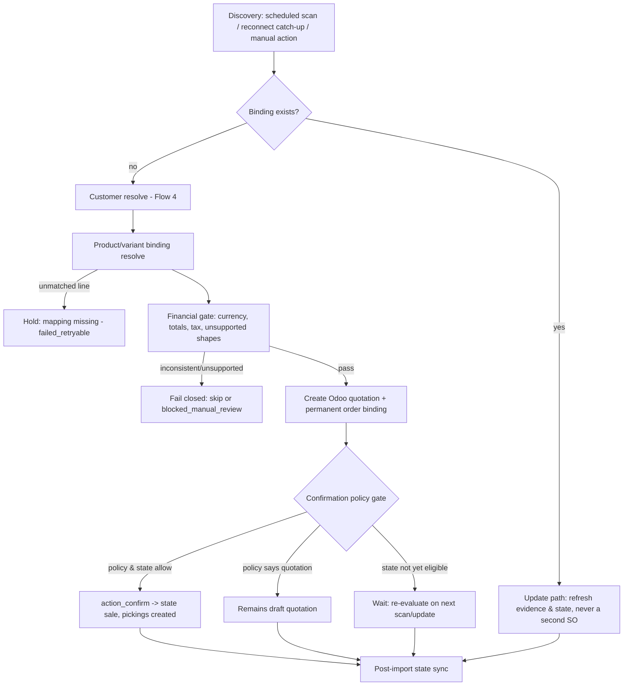

# Sales Order Lifecycle and Confirmation Policy

> **Status: Proposed — Fable gap-closure mission, 2026-07-16.** Docs-only;
> no implementation authorized. Acceptance authority: product owner +
> Claude control room; feeds the revised Task 012 packet (Wave 2). This
> document layers *confirmation policy* on top of — and never contradicts —
> the accepted order-import decisions (DEC-007, DEC-020, Flow 5 of
> [`mvp-user-flows-and-state-models.md`](./mvp-user-flows-and-state-models.md))
> and the Task 012 decision closures D-012-1..12 in
> [`task-012-order-import-implementation-packet.md`](../07-implementation-plan/task-012-order-import-implementation-packet.md).
> Where a statement here would conflict with an accepted decision, the
> accepted decision wins and the conflict must be raised, not resolved
> silently.

Primary evidence:
[Shopify captures 2026-07-16](../00-source-materials/shopify-orders-cod-abandoned-fulfillment-captures-2026-07-16.md)
(§1 financial states, §2 transactions/COD, §3 order surface, §4 60-day
window, §7 webhooks vs polling, §8 refunds) and
[Odoo 19 captures 2026-07-16](../00-source-materials/odoo19-sale-stock-security-captures-2026-07-16.md)
(§1 sale lifecycle, §4 payments/AR surface).

---

## 1. Order lifecycle overview

[Fact] Odoo 19 `sale.order.state` is `draft` (Quotation) → `sent` →
`sale` (Sales Order) → `cancel`; there is no `done` state — locking is a
separate boolean ([Odoo capture §1](../00-source-materials/odoo19-sale-stock-security-captures-2026-07-16.md)).
[Fact] `action_confirm()` sets `state='sale'` and, with `sale_stock`
installed, launches stock rules that create and confirm delivery pickings
(same capture, §1–2). Confirmation is therefore the *stock-consequential*
step this policy governs.

[Proposed product decision] The connector's order pipeline is a fixed
sequence of gates; an order only reaches the confirmation-policy gate
after every earlier gate passes, and every gate fails closed:

1. **Discovery** — scheduled scanning (`scheduled_sync` using
   `updated_at:>…` + cursor pagination — [Fact] the `orders` query
   supports these filters, Shopify capture §3), reconnect catch-up
   (`reconciliation` after a `Reconnect needed` period), or permitted
   manual action (`manual_sync`). Webhooks remain enqueue-only signals
   with an authoritative follow-up read (Flow 5; [Fact] Shopify: webhook
   delivery/ordering is not guaranteed — capture §7). [Fact] Only the
   last 60 days of orders are readable without `read_all_orders`
   (capture §4) — the import window setting (§7 below) must respect this.
2. **Duplicate detection** — binding lookup before any create (§3).
3. **Customer resolution** — Flow 4 (email-first, ambiguity → review).
4. **Product/variant binding resolution** — unmatched line → whole-order
   hold (`mapping missing`, `failed_retryable`) per accepted Flow 5.
5. **Financial gate** — shipping/discount/tax/currency/total
   verification per DEC-007/DEC-020/D-012-2..10 (§4).
6. **Sale-order creation** as an Odoo **quotation** (`draft`) + creation
   of the permanent order binding, atomically (§3).
7. **Confirmation-policy gate** — this document's subject (§2): decides
   whether the connector calls `action_confirm()`.
8. **Post-import state sync** — Shopify financial / fulfillment /
   cancellation state exposed on the Odoo record and reconciled on later
   `orders/updated` / `orders/edited` / scan evidence (§2.3, §3.2).

### 1.1 The three confirmation policies (Administrator choice, per store)

[Proposed product decision] The store Administrator chooses exactly
**one** `order_confirmation_policy` per store:

| Policy | Behaviour | Notes |
| --- | --- | --- |
| **P1 — Confirm paid orders only** | Only `PAID` orders are auto-confirmed; everything else eligible imports as a quotation or waits. | **Default and recommended** — never reserves stock for money not yet captured. |
| **P2 — Confirm paid or authorized** | `PAID` and `AUTHORIZED` auto-confirm. | For merchants using manual capture who fulfil before capture. [Fact] `AUTHORIZED` = payment validated, manual capture pending (Shopify capture §1). |
| **P3 — Import as quotations** | Every eligible order imports as a `draft` quotation; a User confirms manually in Odoo. | The connector never calls `action_confirm()` under P3. |

[Proposed product decision] Approved **manual-payment gateways** (COD,
bank transfer, pay on pickup) get a **separate** `manual_gateway_policy`
that overlays P1/P2/P3 for orders whose payment is a manual gateway:
*confirm automatically* / *create quotation* / *require User approval*
(a review-queue approval by a connector User before confirmation).

[Fact] The discriminator for the manual-payment path is
`OrderTransaction.manualPaymentGateway = true` plus the gateway identity
(`gateway`/`paymentGatewayNames`), **never** `displayFinancialStatus:
PENDING` alone — a pending online-card transaction is a gateway-processed
transaction with `manualPaymentGateway: false`
([Shopify capture §2](../00-source-materials/shopify-orders-cod-abandoned-fulfillment-captures-2026-07-16.md)).
[Proposed product decision] The manual path additionally requires the
gateway to appear on the Administrator's per-store **approved manual
gateway list**; a manual gateway not on the list is treated like an
ordinary pending payment (no auto-confirm).

## 2. Complete financial-state map

[Fact] `OrderDisplayFinancialStatus` has exactly 8 values, none
deprecated (Shopify capture §1). [Fact] The field is nullable.
[Proposed product decision] A null financial status fails closed:
`blocked_manual_review` (duplicate-risk-adjacent sub-reason "binding
conflict" is wrong here — see Open question OQ-A on class mapping).

Legend: **SO** = confirmed sale order (`state='sale'`); **Q** = draft
quotation; **Wait** = no SO yet, re-evaluated on later scans (job ends
`skipped` with reason `awaiting_payment_state`, order tracked);
**Skip+review** = fail closed with an error-center / review entry; **No
import** = policy skip with audit reason, no Odoo record. "Reserve"
means confirmation is allowed and therefore pickings are created —
reservation timing then follows Odoo's own `reservation_method` (§5).

### 2.1 State × policy matrix (non-manual gateways)

| Financial state | P1 (paid only — default) | P2 (paid or authorized) | P3 (quotations) | Confirm allowed | Stock may reserve | User review req. | Auto-retry/rescan | Odoo surface (badge) |
| --- | --- | --- | --- | --- | --- | --- | --- | --- |
| `PAID` | **SO** | **SO** | Q | P1/P2 yes; P3 no | P1/P2 yes | No | n/a | "Paid" (green) |
| `AUTHORIZED` | Q *(await capture)* | **SO** | Q | P2 only | P2 only | No | Rescan until capture/expiry | "Authorized — capture pending" (blue) |
| `PENDING` (card / non-approved gateway) | **Wait** — never confirm | **Wait** — never confirm | Q *(marked "payment pending")* | No | No | No | Yes — rescan until it resolves | "Payment pending" (grey) |
| `PARTIALLY_PAID` | Skip+review | Skip+review | Q + review flag | No (never auto) | No | **Yes** | No auto-retry; User decision | "Partially paid" (amber) |
| `PARTIALLY_REFUNDED` | Skip+review *(new import)* | Skip+review | Skip+review | No | No | **Yes** | No | "Partially refunded" (amber) |
| `REFUNDED` | **No import** (policy skip) | No import | No import | No | No | No (audit only) | No | Visible only if already imported: "Refunded" (red) |
| `VOIDED` | **No import** (policy skip) | No import | No import | No | No | No (audit only) | No | If already imported: "Voided" (red) |
| `EXPIRED` | **No import** (policy skip) | No import | No import | No | No | No (audit only) | No | If already imported: "Authorization expired" (red) |

Rationale notes:

- [Fact] `PARTIALLY_PAID` = manual capture below full value;
  `PARTIALLY_REFUNDED`/`REFUNDED` involve refund records; `EXPIRED` =
  capture missed the provider deadline or failed processing; `VOIDED` =
  authorized-not-captured order manually canceled (capture §1).
  [Inference] All five are financially unusual at *first import* and are
  exactly the "financially inconsistent or unsupported" class the binding
  direction requires to fail closed. [Fact] Refund handling is out of
  MVP scope and refunded/removed quantities already fail closed in Task
  012 (round-3 correction (j), packet banner) — this table is consistent
  with that.
- [Proposed product decision] `PENDING` with a card gateway is a **wait**
  state, not an error: the payment provider "needs time to complete the
  payment" [Fact, capture §1]. The connector re-reads on the next scan /
  `orders/updated` evidence; no quotation is created under P1/P2 to avoid
  quotation litter for payments that fail. Under P3 a quotation *is*
  created (P3's premise is manual triage) with a "payment pending" flag.
- [Open question OQ-B] Whether P1/P2 `PENDING`-wait should optionally
  create an early quotation (merchant preference for visibility) —
  proposed as a later per-store toggle, not MVP.

### 2.2 Manual-gateway overlay

Applies only when the order's transaction evidence shows
`manualPaymentGateway = true` **and** the gateway is on the approved
list. [Fact] COD orders carry `displayFinancialStatus: PENDING`
(capture §1 quote on PENDING; §2).

| Financial state + manual gateway | `manual_gateway_policy = confirm automatically` | `= create quotation` | `= require User approval` |
| --- | --- | --- | --- |
| `PENDING` (approved manual gateway) | **SO** — confirmed, stock reserves; badge "COD/manual — payment on delivery" | Q | Q + review-queue item; User approval confirms |
| `PENDING` (manual gateway **not** on approved list) | Treated as base-policy PENDING (**Wait** / Q under P3) — never the manual path | same | same |
| `PENDING` (card gateway, `manualPaymentGateway=false`) | **Never** the manual path — base matrix row applies (wait/rescan, never confirm) | same | same |
| `PAID` (manual gateway — e.g. merchant used `orderMarkAsPaid`) | Base matrix `PAID` row applies (the money question is resolved) | same | same |
| Any other state + manual gateway | Base matrix row applies; the overlay only widens `PENDING` | same | same |

[Inference] The overlay is deliberately narrow: manual gateways only
change the meaning of `PENDING` (for COD, "pending" *is* the normal
fulfil-now state); every other financial state already has a
gateway-independent meaning.

### 2.3 Transition and reconciliation behaviour

[Fact] Order data is mutable post-import (`orders/updated`,
`orders/edited`; capture §3) and the accepted Flow 5 rule is
**evidence refresh only — never a silent SO data update**. This section
extends that rule to *state* transitions, which may change connector
status fields and (only in the named cases) trigger the confirmation
gate — never a silent financial-line rewrite.

| Transition | Behaviour |
| --- | --- |
| `PENDING → PAID` | The tracked wait-state order re-enters the confirmation gate: P1/P2 confirm now (create SO if quotation exists → confirm it; if only tracked, run full import); P3 quotation badge flips to "Paid". Idempotent — the existing binding guarantees no second SO. |
| `PENDING → EXPIRED` / `VOIDED` | Stop waiting; audit entry; any P3 quotation is flagged "payment failed — cancel?" for User action (the connector does not auto-cancel a quotation a User may have touched). [Proposed product decision] |
| `AUTHORIZED → PAID` | P1: order re-enters gate and confirms. P2: already confirmed — badge update only. |
| `AUTHORIZED → EXPIRED` / `VOIDED` | P1/P3 quotation: flag "authorization lapsed" for User action. P2 confirmed SO: **never auto-cancel**; surface a prominent "payment lost after confirmation" review item (`blocked_manual_review`); User decides (cancel SO, re-collect, etc.). [Proposed product decision] |
| `PAID → PARTIALLY_REFUNDED` / `REFUNDED` | Badge + review item on the existing SO; **no** automatic credit note, SO cancellation, or return creation (refunds out of MVP scope — DEC-003/RA-010 posture; see §6). [Fact] Refund truth lives in `Refund.transactions`, not `displayFinancialStatus` alone (capture §8) — the evidence record captures both. |
| Any state change on a `locked` or delivered SO | Surface only; never mutate. [Fact] Odoo refuses cancellation of locked orders (Odoo capture §1). |

[Proposed product decision] Every state transition is recorded on the
binding (old → new, evidence timestamp, trigger source) so the timeline
is auditable.

## 3. Duplicate prevention and the permanent order binding

- [Proposed product decision] **One permanent binding per Shopify
  order**: `shopify.connector.order.binding` keyed unique on
  `(store_id, shopify_order_gid)`, created in the same transaction as
  the sale order, pointing at `sale_order_id` ([Fact] DEC-034 makes
  `_odoo_binding_field_name() = 'sale_order_id'` a binding cross-packet
  contract — packet banner). The binding is never deleted on
  disconnect/disable (DEC-018 MBQ-08 history-preservation rule).
- **Idempotent re-import.** Any discovery path (scan, catch-up, manual,
  webhook follow-up read) that finds an existing binding takes the
  **update path**: refresh evidence and connector state fields per §2.3.
  A second Odoo sale order for the same Shopify order is structurally
  impossible while the unique binding exists. [Inference] This is the
  identity half of duplicate prevention; operation-level idempotency for
  outbound mutations remains DEC-009/RA-017 territory and is unaffected.
- **Order edits.** [Fact] Shopify edits go through
  `orderEditBegin` → staged `CalculatedOrder` → `orderEditCommit`, which
  fires `orders/edited`; only unfulfilled items are editable; edits can
  change lines and totals (capture §3). [Proposed product decision] An
  `orders/edited`-detected change is an evidence refresh + divergence
  check: if the refreshed totals no longer reconcile with the Odoo SO,
  route through the total-check posture (financial divergence review) —
  never a silent SO line edit (accepted Flow 5 rule; edit *support* is
  deferred per DEC-003).
- **Cancellations.** [Fact] `cancelledAt`/`cancelReason` mark
  cancellation (capture §3). [Fact] Odoo: cancelling an SO cancels only
  non-`done` pickings and preserves done ones; locked orders can't be
  cancelled (Odoo capture §1). [Proposed product decision] behaviour by
  SO stage:
  - **Before confirmation** (quotation / wait-state): auto-cancel the
    quotation with audit reason (nothing shipped, nothing reserved —
    safe), or drop the wait-tracking.
  - **After confirmation, before any delivery**: review item ("Shopify
    order cancelled — cancel the Odoo order?") with a one-click assisted
    cancel; not fully automatic, because pickings may be in progress.
  - **After partial delivery**: `blocked_manual_review` always — stock
    has moved; returns/refunds are out of MVP scope, so the connector
    surfaces the facts and the User decides. COD-specific cancellation
    cases (courier return, failed delivery) follow the COD/returns
    posture in the Odoo capture §2 returns evidence and the COD flow
    design: stock re-enters inventory **only** when a validated return
    picking exists — never on a claim.

## 4. Financial consistency gate (fail closed)

All accepted / packet-closed rules restated for completeness — this
document adds nothing to them, it sequences them *before* the
confirmation gate:

- [Fact — accepted DEC-007] The **total-check guard is mandatory and
  unbypassable**; mismatch → `financial total mismatch` error class with
  an inline receipt-style breakdown (Flow 5). The exact ledger
  (`U_ex = M + H + T`, per-signature tax base reconciliation,
  engine-derived `tax_delta_bound`) is D-012-2 and is not restated here.
- [Fact — decided DEC-020 MBQ-64] Same-currency check
  (`presentmentCurrencyCode == currencyCode` and = SO company currency);
  divergent currency blocks **before** SO creation; D-012-3 routes it as
  a policy `skipped`, never overloading `financial_total_mismatch`.
- **Tax posture** — explicit-mapping-only, no auto-create, ambiguous
  mapping → hold (D-012-8/9, round-6 closures).
- **Unsupported shapes fail closed** as policy skips or holds per
  D-012-10 and the round-3..9 gate families: refunded/removed
  quantities, nonzero duties, unsupported additional fees, cash
  rounding, nonzero tips, unsupported tax structures.
- [Proposed product decision] **Class mapping onto the fixed 16-class
  taxonomy** (no 17th class — accepted vocabulary): transient transport/
  throttle → `retry_waiting`; data-shape mismatch and fixable mapping
  gaps (`mapping missing`, tax mapping absent) → `failed_retryable`;
  ambiguity and duplicate risk (customer ambiguity, binding conflict,
  null financial status, post-confirmation payment loss, cancellation
  after delivery) → `blocked_manual_review` with the matching accepted
  sub-reason; deliberately-unsupported orders (divergent currency,
  duties, refunded state at first import) → `skipped` with a named
  policy reason — visible, auditable, re-triggerable, but not an error.

[Inference] Confirmation-policy evaluation strictly after this gate
means a confirmed SO can never exist for an order whose money evidence
did not reconcile — the confirmation policy chooses *when*, the
financial gate chooses *whether*.

## 5. Stock reservation interaction

- [Fact] Confirming a sale order launches stock rules and confirms
  pickings (`_action_launch_stock_rule`; Odoo capture §1). [Fact]
  *Reservation* timing is then governed by the picking type's
  `reservation_method` — `at_confirm` / `manual` / `by_date` (capture
  §2). So "confirm" ⇒ picking exists; reservation follows the merchant's
  own Odoo configuration.
- [Proposed product decision] Therefore the only states that may ever
  cause reservation are those where confirmation is allowed: `PAID`
  (P1/P2), `AUTHORIZED` (P2 only), and approved-manual-gateway `PENDING`
  under `confirm automatically` (or after explicit User approval).
  Quotations, wait states, and all review/skip states never create
  pickings and never reserve. The connector does **not** override
  `reservation_method` and does not write reservations directly
  (consistent with DEC-010's posture that `committed`/reservation
  mechanics are Odoo's own).
- [Inference] Under P2, `AUTHORIZED → EXPIRED` can leave reserved stock
  behind a lost payment — this is the inherent cost of P2 and exactly
  why P1 is the default; the §2.3 review item is the mitigation.

## 6. Out of scope (unchanged boundaries)

- **No invoice or payment automation by default.** [Fact] Accepted
  DEC-003/DEC-007 and RA-010
  ([rejected-approaches-log](../05-qa/rejected-approaches-log.md))
  exclude automatic posted invoices/payments/reconciliation. [Fact]
  Odoo's payment-register wizard immediately posts and auto-reconciles
  (Odoo capture §4) — the capture's recommendation stands: operational
  payment visibility on connector records; accounting posting only
  behind explicit Administrator configuration, and none of it in MVP.
  [Fact] `sale.order` has no `payment_state` of its own (capture §4) —
  hence the connector-owned Shopify-state fields in §7/§8.
- **No order edits pushed back to Shopify.** Odoo-side SO changes are
  never exported as Shopify order edits (DEC-003 direction matrix).
- **No refund creation** in either direction; refund states are
  surfaced only (§2.3).
- Confirmation policy never bypasses any accepted guard (setup-complete
  gate, total-check, pre-create gate, first-push guard).

## 7. Per-store settings this policy adds (design, not code)

[Proposed product decision] All per-store, Administrator-only (Odoo 19
`groups=` field protection per the security capture §5):

| Setting | Values | Default |
| --- | --- | --- |
| `order_confirmation_policy` | `paid_only` / `paid_or_authorized` / `quotations_only` | `paid_only` |
| `manual_gateway_policy` | `confirm_auto` / `quotation` / `require_approval` | `require_approval` |
| `approved_manual_gateways` | list of gateway identities (matched against transaction `gateway` / `paymentGatewayNames`) | empty (no manual path until curated) |
| `order_import_window` | scan lookback horizon; capped at 60 days unless `read_all_orders` is granted ([Fact] capture §4) | 30 days |
| `pending_wait_expiry` | how long a card-`PENDING` order is tracked before it is dropped with an audit entry | proposed 7 days [Open question OQ-C] |

Changing `order_confirmation_policy` affects **future** gate
evaluations only; already-imported quotations are not retro-confirmed
(a User can confirm them manually). [Proposed product decision]

## 8. UX summary

[Recommendation] Surfaces (full treatment deferred to the planned
`premium-ux-master-specification.md`, gap U-1 of the
[gap inventory](../01-research/mvp-remaining-gap-inventory.md)):

- The Odoo sale order shows a connector panel with four state strips:
  Shopify **financial** status, **fulfillment** status, **cancellation**
  status, and **connector** status (bound / wait / hold reason) — plain
  words, badges per §2.1's last column, internal tokens never primary
  (MBQ-22 rule).
- The wizard/settings screen presents the three policies as one radio
  choice with one-line consequences ("Reserve stock only for captured
  payments — recommended"); the manual-gateway list is a curated
  pick-list from gateways actually observed on the store.
- Wait-state and approval-queue orders appear in the existing review/
  activity surfaces (no new screen family; RA-013 one-surface rule).

## 9. Test / UAT hooks

The QA matrices for Wave 2 must cover at least these scenario families:

1. **8 × 3 state/policy matrix** — every §2.1 cell, asserting Odoo
   result, confirmation, picking existence, and badge.
2. **Manual-gateway overlay** — approved COD `PENDING` under each of the
   three sub-policies; unapproved manual gateway; card `PENDING`
   (`manualPaymentGateway=false`) must never confirm.
3. **Transitions** — `PENDING→PAID` (wait→confirm, single SO),
   `PENDING→EXPIRED`, `AUTHORIZED→PAID/EXPIRED/VOIDED` under P1 and P2,
   `PAID→PARTIALLY_REFUNDED/REFUNDED` post-confirmation.
4. **Idempotency** — re-scan / duplicate webhook / manual re-import of a
   bound order never creates a second SO; update path refreshes state.
5. **Edits & cancellations** — `orders/edited` divergence routing;
   cancellation before confirm / after confirm / after partial delivery;
   locked-order surface-only behaviour.
6. **Financial gate ordering** — divergent currency, total mismatch, and
   unsupported shapes block before any SO exists regardless of policy.
7. **Reservation** — confirmed SO + each `reservation_method`; no
   reservation from quotations/waits.
8. **Settings changes** — policy switch mid-stream (no retro-confirm);
   gateway list edits; import window vs 60-day cap.
9. **Null/edge evidence** — null `displayFinancialStatus`; multiple
   transactions with mixed gateways [Open question OQ-D].

## 10. Proposed decisions and open questions

**Proposed product decisions (for product-owner + control-room
acceptance, then ADR):**

- PD-A: the three-policy `order_confirmation_policy` with `paid_only`
  default (§1.1).
- PD-B: the separate three-value `manual_gateway_policy` +
  Administrator-curated approved-gateway list, discriminated by
  `manualPaymentGateway` + gateway identity, never by `PENDING` alone
  (§1.1, §2.2).
- PD-C: the full state × policy matrix and transition table (§2),
  including wait-not-error for card `PENDING` and never-auto-cancel of
  confirmed SOs.
- PD-D: cancellation staging (auto before confirm / assisted after
  confirm / review after partial delivery) (§3).
- PD-E: the settings inventory and defaults (§7).

**Open questions:**

- OQ-A: exact error-class + sub-reason assignment for null financial
  status and post-confirmation payment loss within the fixed 16-class /
  6-sub-reason vocabulary — control-room mapping decision.
- OQ-B: optional early quotation for card-`PENDING` under P1/P2 (post-MVP
  toggle?).
- OQ-C: `pending_wait_expiry` default and whether expiry should notify.
- OQ-D: policy resolution when an order carries **mixed** transactions
  (e.g. part gift-card, part manual gateway) — needs a fresh evidence
  pass on multi-transaction orders; fail closed to review until decided.
- OQ-E: `orderMarkAsPaid` / `orderCreateManualPayment` input shapes are
  Partial sources (capture §2) — re-verify before any Wave 2 use.

No implementation is authorized by this document.
