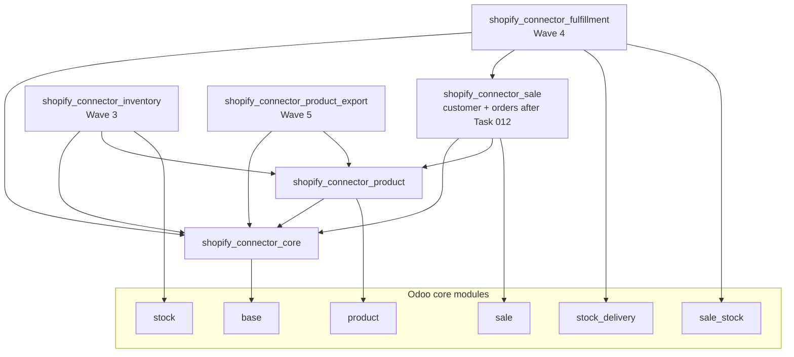

# Modular Architecture Recommendation — Module-Family Validation for the Remaining MVP

> **Status: Proposed — Fable gap-closure mission, 2026-07-16.** Validates/revises
> the module hypothesis on top of accepted
> [DEC-008](../04-decisions/DEC-008-module-boundary-strategy.md) and the proposed
> [final-mvp-module-and-dependency-architecture.md](final-mvp-module-and-dependency-architecture.md)
> (PD-1..9); acceptance authority: product owner + Claude control room.
> No implementation authorized.

This document evaluates the **10-module hypothesis** —
`shopify_connector_core / _product / _customer / _sale / _inventory /
_fulfillment / _accounting / _refund / _payout / _multi_store` — against the
actual repository state (three merged modules, read 2026-07-16), the accepted
decision base (DEC-008, DEC-029/030), and the rejected-approaches log
(RA-011 no monolith, RA-012 no micro-module explosion, RA-013 shared substrate
in core — [rejected-approaches-log.md](../05-qa/rejected-approaches-log.md)).
The hypothesis is **not treated as final**; each hypothesized module gets an
explicit verdict.

## 1. Current code facts (baseline)

- **[Fact — merged code, read 2026-07-16]** Three real modules exist:
  - `shopify_connector_core` (v19.0.1.9.1, depends `[base]`): store,
    credential, settings, location cache, binding mixin, job, log, lease,
    API client, enqueue, dispatch, readiness, PII retention; 4 security
    groups; 3 crons.
  - `shopify_connector_product` (depends `[shopify_connector_core, product]`):
    template + variant bindings, attribute lock, importer, settings extension.
  - `shopify_connector_sale` (depends `[shopify_connector_core]` — **not**
    Odoo `sale`): customer binding + importer, `res.partner` email index,
    inert fallback field. The customer domain lives here today.
- **[Fact — merged code]** Extension seams already in core: `_get_handlers()`,
  `_get_replay_policies()`, `job_type` `selection_add` with historic
  `ondelete`, readiness `_get_checks()` plus named slot placeholders
  (`_check_webhook_hmac` for the webhook slice, `_check_mapped_location` for
  inventory), settings `_inherit`, binding classification hooks,
  `execute_business`.
- **[Fact — merged code]** Store records are multi-row: the data model is
  already multi-store-shaped (store-scoped credentials, settings, bindings,
  jobs), with per-store domain-enablement flags.

## 2. Verdicts on the 10-module hypothesis

| Hypothesized module | Verdict | Basis |
| --- | --- | --- |
| `shopify_connector_core` | **✔ Confirmed — exists** | [Fact] merged, substrate hub per DEC-008/RA-013. |
| `shopify_connector_product` | **✔ Confirmed — exists** | [Fact] merged (import slice). |
| `shopify_connector_customer` | **✘ Rejected as a separate MVP module** | §2.1. |
| `shopify_connector_sale` | **✔ Confirmed with a naming problem** | §2.2. |
| `shopify_connector_inventory` | **✔ Confirmed — future module (Wave 3, Task 013)** | Per DEC-008 + final architecture §1. |
| `shopify_connector_fulfillment` | **✔ Confirmed — future module (Wave 4, Task 014)** | §2.3 (incl. the "never on inventory" check). |
| `shopify_connector_accounting` | **✘ Do not create now — post-MVP** | §2.4. |
| `shopify_connector_refund` | **✘ Do not create now — post-MVP** | §2.4. |
| `shopify_connector_payout` | **✘ Do not create now — post-MVP** | §2.4. |
| `shopify_connector_multi_store` | **✘ Rejected as a module** | §2.5. |
| `shopify_connector_product_export` *(not in the hypothesis)* | **✔ New module, Wave 5 (PD-1)** | §2.6. |

### 2.1 Customer — rejected as a separate module for MVP

- **[Fact]** The customer domain (customer binding, importer, email-index
  matching, review paths) is already merged inside `shopify_connector_sale`.
- **[Inference]** Splitting a working, runtime-green domain out of its module
  now would be pure churn: model moves, XML ID migration, data migration for
  existing binding rows, retesting — with **zero** independent-activation
  payoff, because MVP customer import exists to serve order import (an order
  cannot be imported without customer resolution). That is exactly the RA-012
  over-fragmentation pattern.
- **[Recommendation]** Keep customer inside `shopify_connector_sale` for MVP,
  exactly as DEC-008 folded it ("Phase 1 — folded in, not split").
- **[Open question / revisit condition]** Revisit a `_customer` split when
  **customer export** (Phase 2, deferred by DEC-003) is scheduled — outbound
  customer sync is the first capability that would need customer independent
  of orders. The seam already exists: the customer binding is a separate model
  with its own identity shape (DEC-008 risk 1 mitigation), so a later
  promotion is a clean module move, not a redesign.

### 2.2 Sale — confirmed, with a naming/packaging tension to record

**The problem [Fact]:** the module named `shopify_connector_sale` today
contains only the **customer** slice and does not depend on Odoo `sale`.
Task 012 (PD-3, [final architecture §1.2](final-mvp-module-and-dependency-architecture.md))
will make it the **order** module with depends
`[shopify_connector_core, shopify_connector_product, sale]` — and order import
needs the customer bindings that are already inside it. So PD-3 holds and the
module grows into its name.

Options considered:

1. **Keep the name, document the reality — [Recommendation, recommended].**
   No rename churn; XML ID and external-ID stability preserved
   **[Fact — captures 2026-07-16 §5]**: renaming module-owned XML IDs is
   delete+create on upgrade, so a rename risks data-file record loss. The name
   becomes accurate the moment Task 012 lands. Cost: a short transitional
   period where the name over-promises; mitigated by this record.
2. **Split customer out into `_customer` — rejected for MVP** (§2.1).
3. **Rename the module (e.g. `shopify_connector_order`) — rejected.**
   **[Inference]** An Odoo module rename is effectively uninstall+reinstall
   (module name is the technical key for `ir_model_data`, table prefixes of
   `selection_add` ownership, and dependency declarations); on any database
   that has run customer import this loses binding rows per the uninstall
   mechanics in §5. Upgrade risk with no functional payoff.

### 2.3 Fulfillment — confirmed; the "never on inventory" rule survives Mode 2

- **[Fact — DEC-008, accepted]** `fulfillment` depends on `core + sale` and
  **never** on `shopify_connector_inventory`, and must not read inventory's
  location-mapping table.
- Check against the fulfillment-modes design: Mode 2 (Shopify-location-aware
  fulfillment) needs to resolve a Shopify location. **[Fact — merged code]**
  the Shopify **location cache lives in `shopify_connector_core`** (core's
  location model, listed in §1). **[Inference — resolution, stated
  explicitly]** Mode 2 therefore needs **no dependency on the inventory
  module**: it reads core's location cache, not inventory's
  `shopify.connector.location.mapping` table. DEC-008's rule holds unmodified;
  the link-module contingency DEC-008 flagged (fulfillment reusing inventory's
  mapping) is **not** triggered. If a future fulfillment mode ever needs the
  *mapping* (Odoo-location ↔ Shopify-location pairs) rather than the *cache*
  (Shopify locations), that is the DEC-008 link-module case — [Open question],
  routed to architecture review then, not now.
- **[Fact — final architecture §1]** Odoo deps: `stock_delivery` + `sale_stock`
  (red-team-verified: `picking.sale_id`, `move.sale_line_id`, and
  SO-confirmation picking generation live in `sale_stock`).

### 2.4 Accounting / refund / payout — post-MVP; do not create now

- **[Recommendation]** Do **not** create these modules (not even empty
  placeholders) in the MVP program. Premature empty modules are dead packaging
  weight: they would ship untested manifests, occupy names before their own
  architecture passes run, and invite scope creep — the RA-012 failure mode by
  another route. DEC-008 already lists them as "later addon family" with
  boundaries explicitly **not finalized**; DEC-029 point 4 keeps them as
  named Phase 2/3 add-ons only.
- Revisit conditions (from
  [non-mvp-and-later-phases.md](../02-product/non-mvp-and-later-phases.md)):
  accounting — a ChatGPT/product-owner decision to automate invoices/payments
  as an explicit, idempotent, opt-in module (RA-010's condition); refund —
  refund/cancellation-reflection scheduled with its own identity/idempotency
  design; payout — payout/bank reconciliation scheduled, which additionally
  presupposes the accounting pass.

### 2.5 Multi-store — rejected as a module

- **[Fact — merged code]** Store records are already multi-row; every
  substrate object (credentials, settings, flags, bindings, jobs) is
  store-scoped. Multi-store is a **property of the core data model**, not a
  capability that can live in a bolt-on module.
- **[Inference]** A `_multi_store` module could only exist as (a) a UI
  convenience layer — which PD-2 already assigns to owning modules — or
  (b) a commercial **limit** on store count, which is entitlement/licensing
  enforcement, explicitly deferred by DEC-029 point 7 and out of this
  document's scope.
- **[Recommendation]** Strike `_multi_store` from the module family.
  Multi-store correctness is core's job; any future commercial store-count
  limit is an entitlement-phase decision, not a module boundary.
  [Open question] Whether Phase 2/3 multi-store *orchestration features*
  (cross-store dashboards, store groups) justify a module — decide at that
  phase's own architecture pass.

### 2.6 Product export — confirmed new module (PD-1, Wave 5)

**[Fact — DEC-029, accepted by control room 2026-07-15]** PD-1 is ratified:
controlled product export/update ships as `shopify_connector_product_export`
(depends `core + product`). It is the Lite/Full edition boundary for the
product domain and the write-risk isolation unit (uninstalling it provably
removes all catalog write capability).

### 2.7 Net recommendation

**[Proposed decision — see MA-D1]** The MVP module family is **6 modules**:

`shopify_connector_core`, `_product`, `_sale` (grows orders in Task 012),
`_inventory` (Wave 3), `_fulfillment` (Wave 4), `_product_export` (Wave 5).

Post-MVP candidates with revisit conditions: `_customer` (customer-export
phase), `_accounting` / `_refund` / `_payout` (§2.4), oauth/compliance
surfaces (RA-003 lift). `_multi_store` is removed from the candidate list.

This satisfies the mission constraints: no giant module (RA-011); explicit
one-directional domain dependencies (§3); per-capability enable/disable via
module presence + store flags (§4); Lite/Full mapping (§6); no cycles (§3);
uninstall safety (§5); upgrade safety (stable names/XML IDs, §2.2); extension
seams for the future family (§7); no premature empty modules (§2.4); MVP kept
small but complete.

## 3. Dependency diagram

Rules (all restated from accepted DEC-008 / proposed PD-1/PD-3, no new edges):
strict one-directional DAG toward `core`; `sale` and `inventory` are siblings;
`fulfillment` never depends on `inventory` (§2.3); nothing depends on
`adams_base`; only core touches transport/credential/job/log/readiness code.
**[Fact — captures 2026-07-11 §1, restated from final architecture]**
`sale_stock` is `auto_install` in Odoo 19, so its presence is never an edition
marker. Odoo deps per module: core→`base`; product→`product`; sale→`sale`
(Task 012); inventory→`stock`; fulfillment→`stock_delivery`+`sale_stock`;
product_export→none beyond inherited.

## 4. Capability enablement — the two-level toggle model

**[Fact — merged code]** Per-store domain-enablement flags
(`*_domain_enabled`) already exist on store settings, and
`_domain_flag_for_job_type()` routes every job type to its flag.
**[Recommendation]** Capability availability is therefore two-level, with no
licensing code:

1. **Module installed** → capability *available* (packaging level; editions
   are module sets per DEC-029).
2. **Store flag enabled** → capability *enabled* for that store (operational
   level; Administrator-only toggle; never encodes payment status —
   DEC-029 point 1).

The "Admin toggle" column in §8's matrix refers to level 2. Disable-first is
always the preferred removal path (DEC-029 point 5); uninstall is the designed
permanent path (§5). No safety guard is edition- or flag-bypassable
(DEC-029 point 6, restated).

## 5. Uninstall / upgrade safety and data ownership

**[Fact — captures 2026-07-16 §7]** Odoo 19 uninstall hard-drops module-owned
structures: `_module_data_uninstall` deletes all module-owned xml-id records;
`IrModelFields.unlink()` issues `ALTER TABLE … DROP COLUMN … CASCADE`; model
tables get `DROP TABLE … CASCADE`
([odoo19-sale-stock-security-captures-2026-07-16.md](../00-source-materials/odoo19-sale-stock-security-captures-2026-07-16.md) §7).
**[Fact — DEC-030, accepted]** The supported lifecycle is disable-first;
uninstall uses LC-1 soft-degrade (historic job-type reassignment preserving
job/log audit history in core) plus a pre-uninstall export step
([module-lifecycle-uninstall-design.md](module-lifecycle-uninstall-design.md)).

Per-module data-ownership / survival table:

| Module | Owns (models/fields) | Survives its uninstall | Lost on uninstall (mitigations) |
| --- | --- | --- | --- |
| core | store, credentials, settings, location cache, job, job.log, lease, binding mixin (abstract), readiness, PII retention, groups, crons | n/a — never uninstalled while any domain module is installed (Odoo dependency mechanics) | n/a |
| product | template + variant bindings, attribute lock, settings ext fields, importer | All Odoo products; job/log history (core, via LC-1 historic types) | Product/variant binding rows + settings-ext columns (export step + deterministic SKU/barcode re-match on reinstall) |
| sale | customer binding, order binding (Task 012), `res.partner` email index, `sale.order.line.shopify_line_item_gid`, settings ext | All partners, SOs, evidence attached to Odoo records; job/log history | Customer/order binding rows + owned columns (export + re-match; order re-match is deterministic on Shopify GID via export file) |
| inventory | location mapping, inventory-level binding, first-push guard state, settings ext | All Odoo stock data; job/log history | Mapping/level binding rows (export; re-mapping is an explicit reviewed step — DEC-010 non-inferred mappings) |
| fulfillment | fulfillment binding, mode/notification settings ext | All pickings/tracking in Odoo; Shopify-side fulfillments; job/log history | Fulfillment binding rows (export; historical only — no re-push risk since creates are verification-guarded) |
| product_export | export allowlist/preview state, export job types, settings ext | All import bindings and Odoo products (deliberately isolated — PD-1 reason 2) | Export configuration only |

**Upgrade safety [Inference]:** stable module names and XML IDs are the
upgrade contract — hence the §2.2 rename rejection; group/data XML IDs are
never renamed (captures §5); migration scripts per
`$module/migrations/$version/` when schemas move (captures §7).

## 6. Lite vs Full packaging mapping

Per accepted [DEC-029](../04-decisions/DEC-029-lite-full-packaging-proposal.md)
/ [lite-full-packaging-final-proposal.md](../02-product/lite-full-packaging-final-proposal.md):

- **Lite** = `core + product + sale` — everything Shopify→Odoo, read-only,
  structurally zero Shopify mutations.
- **Full** = Lite + `inventory + fulfillment + product_export`.
- Editions are module sets; **roles ≠ editions** (the 2-role security model is
  orthogonal to packaging); store flags are the operational layer only.

**Layer 2 mutation substrate ships in core even for Lite —
[Recommendation, justified]:** the Layer 2 substrate (mutation-attempt
records + the reconciliation framework; domains register strategies via seam)
is core-owned like jobs/logs (§8 row). In a Lite install it is **inert**: no
mutation domain is installed, so no strategy is registered and no attempt row
is ever written. Shipping it in core (a) keeps the RA-013 rule — one substrate,
never duplicated per domain; (b) makes Full a pure module-add with no core
upgrade step; (c) adds no write capability to Lite — the substrate contains no
Shopify mutation code, only bookkeeping for modules that do. The alternative
(substrate in the first write module) would force `fulfillment`/`inventory`/
`product_export` to depend on whichever peer shipped it — a DAG violation.

## 7. Future extension seams

Existing merged seams **[Fact]** (restated from
[final architecture §7](final-mvp-module-and-dependency-architecture.md)):
`job_type` `selection_add` (+ historic `ondelete`),
`_domain_flag_for_job_type()`, `_get_handlers()`, `_get_replay_policies()`,
store-settings `_inherit`, readiness `_get_checks()` + the named slot
placeholders (`_check_webhook_hmac`, `_check_mapped_location`),
`enqueue()`, the binding mixin + classification hooks, `execute_business`.

Planned seams **[Recommendation — each lands with its owning wave, not
before]**:

1. **Fulfillment-mode strategy hook** (fulfillment module, Wave 4): mode
   resolution behind an overridable strategy method so future modes (multi
   package, partial routing) extend without editing shipped mode code.
2. **COD evidence-source hook** (sale module, Task 012): the COD operational
   ledger resolves its evidence source through an overridable provider, so a
   future payments/accounting module can substitute richer evidence without
   touching order import.
3. **Export field-ownership hook** (product_export, Wave 5): the export field
   allowlist resolves through an ownership registry, the seam a future
   field-ownership matrix (post-MVP bidirectional work, RA-020-guarded) will
   consume.

## 8. Capability / module dependency matrix

Columns: Capability; Owning module; Depends (connector + Odoo); Lite; Full;
Admin toggle (store flag, §4); Mandatory core behavior (M) vs optional
capability (O); Uninstall impact (of the owning module); Data ownership;
Future extension seam.

| Capability | Owning module | Depends | Lite | Full | Admin toggle | M/O | Uninstall impact | Data ownership | Extension seam |
| --- | --- | --- | --- | --- | --- | --- | --- | --- | --- |
| Connection + readiness checks | core | base | Yes | Yes | No (always on) | M | n/a (core stays) | store, readiness state | `_get_checks()` + slots |
| Credentials (store/token) | core | base | Yes | Yes | No | M | n/a | credential records | — |
| Jobs / logs / job actions | core | base | Yes | Yes | No | M | n/a; domain history survives via LC-1 historic types | job, job.log, lease | `selection_add`, `_get_handlers`, `_get_replay_policies`, `enqueue` |
| Security roles (2-role) | core | base | Yes | Yes | No | M | n/a | groups/privilege | implied-groups model |
| Binding substrate (mixin, classification) | core | base | Yes | Yes | No | M | n/a | abstract mixin only | binding classification hooks |
| PII retention/redaction | core | base | Yes | Yes | Retention params only | M | n/a | retention config | redaction field-list extension |
| Layer 2 mutation substrate (attempt records + reconciliation framework) | **core** | base | Yes (inert — no mutation domains installed, §6) | Yes | No | M (substrate) | n/a | attempt records | domains register strategies |
| Product import | product | core + `product` | Yes | Yes | Yes (product flag) | O | binding rows lost (export + re-match) | template/variant bindings | attribute-lock, matching hooks |
| Customer import | sale | core (+product, `sale` after Task 012) | Yes | Yes | Yes (customer flag) | O | customer binding rows lost | customer binding, email index | matching review paths |
| Order import + confirmation policy + COD operational ledger | sale (Task 012) | core + product + `sale` | Yes | Yes | Yes (order flag; confirmation policy per store) | O | order binding rows lost; SOs survive | order binding, line GID field, COD ledger | COD evidence-source hook; `JobPolicySkip` |
| Abandoned-checkout policy (core/none — policy only) | core (policy record only) | base | Yes | Yes | Policy setting | O (policy) | n/a | policy setting only — no checkout data | future checkout module registers |
| Inventory push + reviewed baseline | inventory | core + product + `stock` | No | Yes | Yes (inventory flag; first-push guard) | O | mapping/level bindings lost | location mapping, level bindings | `_check_mapped_location` slot |
| Fulfillment outbound + inbound review + Mode 2 | fulfillment | core + sale + `stock_delivery` + `sale_stock` | No | Yes | Yes (fulfillment flag; notification guard) | O | fulfillment bindings lost | fulfillment binding, mode settings | fulfillment-mode strategy hook |
| Tracking timeline | fulfillment | (as above) | No | Yes | With fulfillment flag | O | timeline rows lost (Shopify state unaffected) | tracking events on binding | — |
| Product export + media export | product_export | core + product | No | Yes | Yes (export flag; preview/confirm guard) | O | export config lost; import bindings untouched (PD-1) | allowlist/preview state | export field-ownership hook |
| Reconnect / backfill per domain | core framework; per-domain handlers | core + owning domain | Yes (installed domains) | Yes | Per-domain flags | O | follows owning domain | checkpoints on settings ext (PD-5) | domain checkpoint fields |
| Premium dashboard / workspaces UI | per PD-2: core owns shared surfaces; each domain contributes its own | owning module | Yes (Lite surfaces) | Yes (all) | No (visibility via groups) | M (core surfaces) / O (domain screens) | domain views drop with module | views in owning module | "contribute, never fork" (RA-013/DEC-016) |
| Performance instrumentation (PB budgets) | core (surface); domains meet budgets | core | Yes | Yes | No | M | n/a | job timing fields | per-packet PB rows |

## 9. Proposed decisions (MA-D1..MA-D5)

Common fields — **Authority:** product owner + Claude control room (DEC-032
model). **Rollback:** each is docs-level; rollback = reject/strike the row
here before the affected wave starts; no code exists to revert.

- **MA-D1 — 6-module MVP family** (core, product, sale, inventory,
  fulfillment, product_export). *Evidence:* §1–§2; DEC-008 DAG; PD-1/PD-3;
  DEC-029. *Alternatives:* 10-module hypothesis (rejected — §2.1/§2.4/§2.5:
  churn + empty modules + a non-module concern); monolith (RA-011).
  *Consequences:* Waves 3–5 create exactly three new modules; no other
  manifest is created in the MVP program. *Risks:* a late-discovered need for
  a split — mitigated by the recorded revisit conditions and existing binding
  seams. *Affected waves:* 3, 4, 5. **Blocking:** must be accepted before
  Wave 3 module creation.
- **MA-D2 — sale-module naming resolution: keep the name, document the
  reality.** *Evidence:* §2.2; captures 2026-07-16 §5 (XML ID stability).
  *Alternatives:* split customer out (rejected for MVP, RA-012); rename
  (rejected — upgrade/data risk, no payoff). *Consequences:* Task 012 lands
  orders into `shopify_connector_sale`; the transitional name mismatch is
  accepted and recorded. *Risks:* reader confusion pre-Task-012 — mitigated
  by this record and module description text. *Affected waves:* 2 (Task 012).
  **Blocking:** before Task 012 execution.
- **MA-D3 — accounting/refund/payout deferral: create no module, not even
  empty placeholders, until each capability's own architecture pass.**
  *Evidence:* §2.4; DEC-029 point 4; RA-010. *Alternatives:* reserve empty
  modules now (rejected — dead weight, premature boundaries).
  *Consequences:* Phase 2/3 passes own their boundaries fresh. *Risks:* name
  squatting is impossible in a private repo — none material. *Affected
  waves:* none in MVP. **Non-blocking** (records the default).
- **MA-D4 — multi-store is a core data-model property, not a module.**
  *Evidence:* §2.5 [Fact] multi-row store model. *Alternatives:* a
  `_multi_store` module (rejected — nothing for it to own except entitlement,
  which is out of scope per DEC-029 point 7). *Consequences:* the hypothesis
  list and DEC-029's add-on name list should drop or re-scope `_multi_store`
  to "multi-store orchestration features, if ever" at the Phase 2/3 pass.
  *Risks:* none for MVP. *Affected waves:* none. **Non-blocking.**
- **MA-D5 — Layer 2 mutation substrate lives in core, shipped inert in
  Lite.** *Evidence:* §6; RA-013. *Alternatives:* substrate in the first
  mutation module (rejected — creates sibling dependencies, breaks the DAG);
  a separate substrate module (rejected — RA-012, no independent-activation
  value). *Consequences:* the Wave 3/4/5 packets register strategies via the
  core seam; Lite ships bookkeeping tables that stay empty. *Risks:* core
  breadth growth — bounded by the accepted "core never contains domain
  mutation logic" invariant (final architecture §1). *Affected waves:* 3, 4,
  5. **Blocking:** before the first mutation-domain wave (Wave 3).

## 10. Open questions

1. **[Open question]** Fulfillment link-module contingency: if a future mode
   needs inventory's location *mapping* (not core's cache), the DEC-008
   link-module pattern applies — decide only when such a mode is proposed
   (§2.3).
2. **[Open question]** `_customer` promotion mechanics at customer-export
   time: model move vs new module consuming sale's binding — needs its own
   migration design then (§2.1).
3. **[Open question]** Whether Phase 2/3 multi-store *orchestration* features
   (store groups, cross-store views) justify a module, given MA-D4 (§2.5).
4. **[Open question]** Exact shape of the Layer 2 strategy-registration seam
   (naming, per-mutation vs per-domain granularity) — Wave 3 packet detail,
   not decided here.
5. **[Open question]** DEC-029's add-on list still names `_multi_store`; if
   MA-D4 is accepted, that list needs a one-line amendment at the next
   packaging-record touch (flagged, not silently edited).
