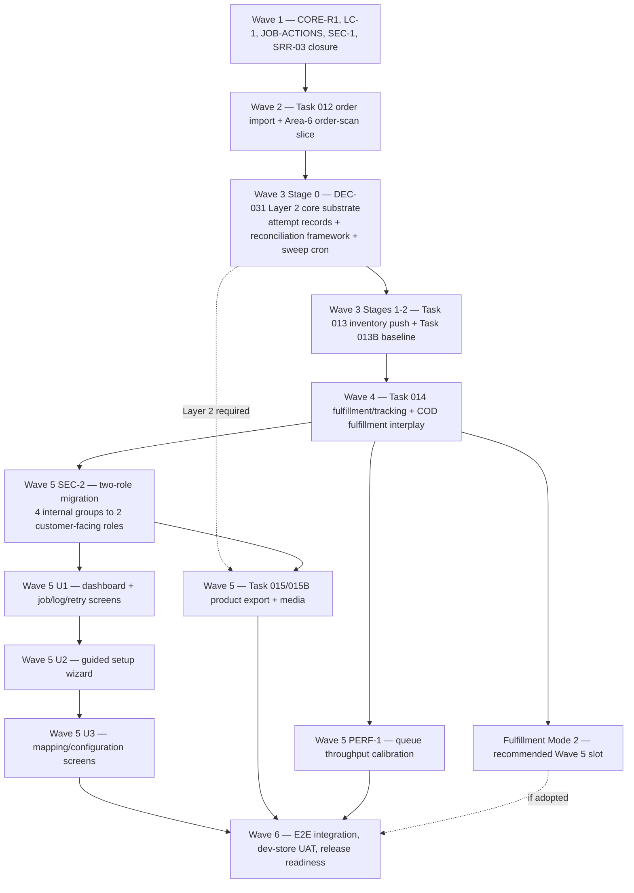

# Waves 2–6 — Dependency and Gate Map

> **Status: Proposed — Fable gap-closure mission, 2026-07-16.** Docs-only.
> Acceptance authority: product owner + Claude control room. **Each wave
> remains unauthorized until its Definition of Ready is accepted and its
> gate decisions are Accepted. No implementation authorized by this
> document.**

Companion to [`mvp-completion-program.md`](mvp-completion-program.md) §4,
[`wave-2-definition-of-ready.md`](wave-2-definition-of-ready.md), and
[`wave-3-definition-of-ready.md`](wave-3-definition-of-ready.md). This map
adds no scope; it makes cross-wave dependencies, decision gates, migration/
rollback shape, and file ownership explicit so no wave silently blocks or
overlaps another.

## 1. Dependency graph

Reading notes:

- **Layer 2 is Wave 3 Stage 0** (Wave 3 DoR §4): a discrete core task, the
  gate for every Shopify-mutation domain (inventory, fulfillment, product
  export, optional `orderMarkAsPaid`).
- **Two-role migration is Wave 5 SEC-2**
  ([`../02-product/connector-roles-and-permissions.md`](../02-product/connector-roles-and-permissions.md)
  §5): a dedicated security packet immediately before U1, so all UI
  role-gating is built once against the two-role model.
- **U1 → U2 → U3** is the accepted UI staging
  ([`ui-implementation-phases-packet.md`](ui-implementation-phases-packet.md)).
- **PERF-1** (queue throughput calibration) runs in Wave 5 once all queue
  producers (orders, inventory, fulfillment) exist.
- **Fulfillment Mode 2** (per
  [`../02-product/fulfillment-operating-modes.md`](../02-product/fulfillment-operating-modes.md))
  is recommended for a Wave 5 slot if adopted — after Wave 4's Mode-1
  foundation, before Wave 6 proof.

## 2. Decision-gate table

Every currently **Proposed** decision family, the first wave it blocks,
and its acceptance authority. A wave may not open while a row blocking it
is unaccepted.

| Proposed decision family | Source document | Blocks | Acceptance authority |
| --- | --- | --- | --- |
| PD-A..E — confirmation policy, manual-gateway overlay, matrix, cancellation staging, settings | `../02-product/sales-order-lifecycle-and-confirmation-policy.md` §10 | Wave 2 | Product owner + control room |
| PD-COD-1..6 — COD state dimensions, stock-restoration rule, ledger, evidence sources, accounting boundary, wave allocation | `../02-product/cod-lifecycle-and-reconciliation.md` §10 | Wave 2 (import subset); Wave 4 (fulfillment interplay); Wave 5+ (`orderMarkAsPaid`) | Product owner + control room |
| PD-RB-1..9 — reconnect/watermark/catch-up/backfill/onboarding windows | `../02-product/reconnect-catchup-backfill-policy.md` §11 | Wave 2 (orders); Wave 3 (inventory read-first); Wave 4 (fulfillment catch-up); Wave 5 (export reconciliation) | Product owner + control room |
| PD-AC-1..4 — abandoned-checkout default-off posture | `../02-product/abandoned-checkout-policy.md` §8 | Wave 2 (PD-AC-1 boundary only; PD-AC-2..4 post-MVP) | Product owner + control room |
| Task 012 packet re-acceptance (+ 2026-07-16 addendum) and §15 gate act | `task-012-order-import-implementation-packet.md` | Wave 2 | Control room gate act |
| Area-6 packet (order-scan slice) acceptance | `area-6-sync-triggers-implementation-packet.md` | Wave 2 | Control room |
| L2-D1..D13 — Layer 2 mutation-safety design | `../03-architecture/dec-031-layer-2-mutation-safety-design.md` | Wave 3 Stage 0 (and therefore all mutation waves) | Product owner + control room |
| Inventory-operating-model PDs 1–12 | `../02-product/inventory-operating-model.md` §12 | Wave 3 | Product owner + control room |
| Task 013 re-acceptance (+ 2026-07-16 addendum) and 013B re-acceptance; §8/§9 gate acts | Task 013/013B packets | Wave 3 | Control room gate acts |
| Fulfillment operating-mode PDs | `../02-product/fulfillment-operating-modes.md` | Wave 4 (Mode 1); Wave 5 (Mode 2 if adopted) | Product owner + control room |
| Task 014 packet acceptance + gate act | `task-014-fulfillment-tracking-implementation-packet.md` | Wave 4 | Control room gate act |
| Two-role model (Option M-A) — SEC-2 | `../02-product/connector-roles-and-permissions.md` §6 | Wave 5 (all UI role-gating) | Product owner + control room |
| Task 015/015B packet acceptance + gate acts | Task 015/015B packets | Wave 5 export slice | Control room gate acts |
| Wave 2/3 Definitions of Ready (these documents) | this directory | their waves | Product owner + control room |
| Release-readiness acceptance + DEC-028 deployment posture proof | `../08-release-readiness/**`; DEC-028 | Wave 6 close / any real-PII UAT | Product owner (final sign-off) + control room |

Already-Accepted gates relied on but not re-listed: DEC-033, DEC-034,
DEC-030 (with LC-1), DEC-031 Layer 1, DEC-010, DEC-018, DEC-020.

## 3. Migration-and-rollback map

Per wave: schema additions, migration scripts needed, rollback strategy,
uninstall impact per DEC-030/LC-1. No wave in this program performs a
destructive or irreversible data migration (program hard-stop 3); every
new `selection_add` job type registers the LC-1
`_reassign_to_historic_job_type` `ondelete` callable from the start.

| Wave | Schema additions | Migration scripts | Rollback strategy | Uninstall impact (DEC-030) |
| --- | --- | --- | --- | --- |
| 2 | `shopify.connector.order.binding`; `shopify.connector.tax.mapping`; sale-order-line GID field; store-settings order/policy/watermark fields; order-scan job types | None (new tables/fields only; no data rewrite) | Single wave-PR revert; read-only toward Shopify — no remote unwind | New tables dropped on module uninstall per LC-1; bindings preserved on disconnect/disable (MBQ-08); job types reassigned historic |
| 3 — Stage 0 | `shopify.connector.mutation.attempt` (core); sweep cron | None | Stage-PR revert before any consumer exists; after consumers exist, revert only with the consuming stage | Attempt evidence retained as audit evidence after any mutation has run (Layer 2 design §12); pruning only via the design's terminal-job retention rule |
| 3 — Stages 1–2 | `shopify.connector.location.mapping`; `shopify.connector.inventory.level.binding` (incl. first-push + pending-target + CAS fields); inventory job types; store-settings inventory fields | Upgrade guard: suspend pre-existing conflicting mappings if found (operating model §7) — non-destructive flagging only | Wave-PR revert drops mapping/binding tables; live Shopify stock untouched by revert; 013B baseline apply is operator-confirmed and reversible only via ordinary Odoo inventory adjustment (documented in its evidence) | Tables dropped per LC-1; no Shopify-side cleanup required (Odoo-authoritative) |
| 4 | Fulfillment-order bindings/state fields; COD dimension/ledger event records; fulfillment job types; readiness scope-name correction | Scope-name correction is code-level, not data | Wave-PR revert; pushed Shopify fulfillments are NOT unwound by revert — attempt records + job log are the audit trail; hence dev-store-only until Wave 6 UAT | Evidence-retention rule as Stage 0; COD collection events are append-only and follow binding retention |
| 5 | SEC-2: new `group_shopify_connector_user` + privilege re-key (legacy groups retained hidden); UI: views/actions/menus only (no schema); Task 015/015B export bindings/fields; PERF-1 cadence params | **SEC-2 migration script** (the one real data migration: membership mapping Operator/Reviewer→User, Admin→Admin; no-escalation tests mandatory; rollback per roles doc §4.10 — delete new group, re-point privileges, legacy memberships intact) | UI revert is view-level, safe; SEC-2 rollback per §4.10; export revert leaves created Shopify products in place (audit-logged, dev-store only pre-UAT) | Hidden legacy groups and new group removed with core per LC-1; export bindings dropped with their module |
| 6 | None (proof wave — no feature schema) | Upgrade-path proof scripts only (DEC-030 upgrade/uninstall demonstration) | n/a — docs/evidence only; any defect fix routes back through the owning wave's rules | Wave 6 *proves* the uninstall/upgrade story end-to-end |

## 4. Cross-wave file-ownership table

Which packet owns which addon paths. A wave may touch another owner's path
only where that owner's packet explicitly grants a named seam; anything
else is scope creep and a wave-gate rejection.

| Path | Owner (wave) | Named seams granted to others |
| --- | --- | --- |
| `addons/shopify_connector_core/**` (baseline models, dispatch, readiness, security, crons) | Wave 1 packets (CORE-R1, LC-1, JOB-ACTIONS, SEC-1) | Task 012: conditional dispatch terminal-state seam (only if CORE-R2 doesn't provide it); Task 013: inheritance-only readiness seams (`_check_mapped_location` override + `_get_checks` append); Task 014: readiness scope-name correction file only; SEC-2: security/groups files |
| `addons/shopify_connector_core/**` (Layer 2 substrate: attempt model, wrapper, sweep) | Wave 3 Stage 0 packet | Consumed (never modified) by Tasks 013/013B/014/015 and any `orderMarkAsPaid` work |
| `addons/shopify_connector_product/**` | Tasks 010/010B (checkpoint-complete) | Read-only to all later waves; Task 015/015B export lives in its own module, not here |
| `addons/shopify_connector_sale/**` (customer import) | Tasks 011/011B (checkpoint-complete) | Task 012 consumes matching services; no file edits |
| `addons/shopify_connector_sale/**` (order binding/importer/tax mapping/settings/order-scan) | Wave 2 (Task 012 + Area-6 order slice) | Wave 4 reads order bindings for fulfillment linkage (no edits); Wave 5 UI wires views to its actions |
| `addons/shopify_connector_inventory/**` | Wave 3 (Tasks 013 + 013B) | Wave 4 may read location mappings via model API (no file edits); Wave 5 UI wires S10–S12 screens |
| `addons/shopify_connector_fulfillment/**` (new) | Wave 4 (Task 014) | Wave 5 UI wiring only |
| Product-export module (new, boundary per Task 015 packet) | Wave 5 (Tasks 015/015B) | — |
| UI files (views/menus/actions/wizards) across all connector addons | Wave 5 (U1/U2/U3 packets) | None — no earlier wave creates UI files |
| `addons/adams_base/**` | **No one — permanently forbidden** | — |
| `docs/**` QA/evidence/plan files | The wave producing them; shared registers append-only | — |

## 5. Maintenance rule

This map is re-verified at every wave gate: the reviewing control room
confirms (a) no row of §2 blocking the opening wave is unaccepted, (b) the
wave's diff stays inside its §4 ownership, and (c) any new proposed
decision family gets a §2 row before its wave's DoR is accepted. Drift
between this map and `mvp-completion-program.md` §4 is resolved in favour
of the program contract, and the conflict is raised, not silently patched.
