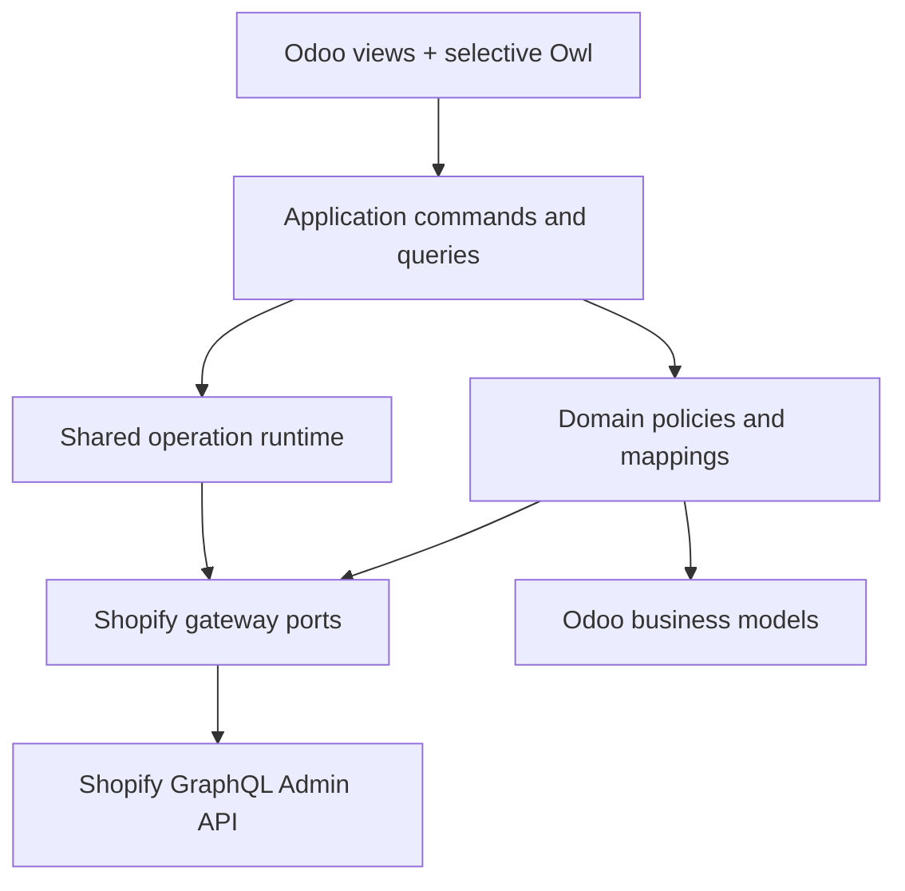
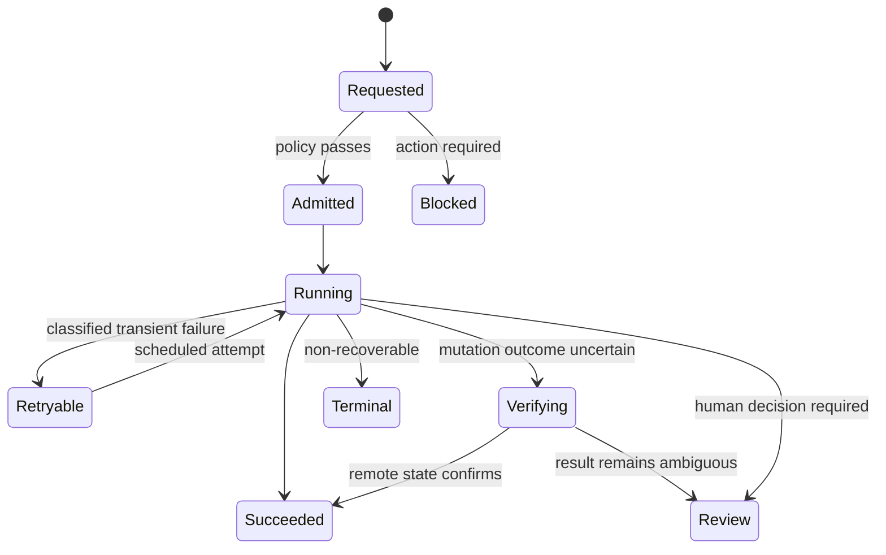

# V2 Target Architecture

> **Classification:** implementation-ready target for architecture-gate review. Existing accepted ADRs remain authoritative until a reviewed ADR explicitly changes them.

## 1. Architectural objective

V2 should be a modular monolith inside Odoo: cohesive domain addons, one shared runtime, explicit application services, small Shopify gateways and projection-driven UI. It avoids both rejected extremes—one giant connector and a micro-addon/microservice explosion.

Dependency direction is enforced: presentation → application → domain/runtime ports → adapters. Domain code never imports controllers, UI components or raw HTTP transport.

### 1.1 Foundation-first construction gate

V2 production frontend wiring begins only after the foundation proves all of the following
on the accepted exact base:

1. V1 compatibility/data/behavior inventory and restore fixture;
2. enforced package dependency direction and stable command/query/error contracts;
3. typed Shopify transport/executor/gateway with bounded pagination and cost evidence;
4. authorization, company/store/generation and secret/PII boundaries;
5. run/job/execution-attempt/mutation-intent semantics, concurrency and failure recovery;
6. fresh install, warm upgrade, interruption/resume and rollback against additive schema;
7. real read DTOs and allowed-action contracts with query/performance budgets.

UI component experiments may consume fixed DTO fixtures, but cannot define backend truth,
security, authority or state transitions. This prevents repeating V1's pattern of strong
backend pieces that were not assembled and proven as complete user journeys.

## 2. Bounded contexts and addon posture

Preserve the accepted domain-aligned addon family and stable technical names during migration:

| Context | Owns | Does not own |
| --- | --- | --- |
| Core/runtime | stores, credential handle, capabilities, runs/jobs/execution attempts/mutation evidence, redacted logs, transport, throttle budget, webhook inbox, handler registry, shared binding contract, readiness registry | product/order/inventory/fulfillment mappings |
| Product | product/variant import, bindings, matching and evidence | catalog mutations |
| Product export | preview, approval and controlled catalog mutations | import matching |
| Sale | customer/order import, bindings, total evidence | inventory or fulfillment execution |
| Inventory | location mapping, first-push guard, Odoo-authoritative quantity commands, drift evidence | fulfillment location selection |
| Fulfillment | picking-triggered FulfillmentOrder orchestration, tracking updates, verification | inventory mapping ownership |

The four domain-specific webhook addons in the current implementation are candidates to fold into their owning domain addons **only after** install/upgrade/uninstall and XML-ID migration proof. The generic receiver and inbox remain core. This is packaging cleanup, not a new webhook architecture.

### 2.1 Future-domain extension contract

Refunds/returns, payouts, metafields, Markets/Catalogs and other later capabilities are
not implemented speculatively in this release. The foundation nevertheless provides small,
typed extension seams so they do not require a core rewrite:

| Extension seam | Later domain contribution |
| --- | --- |
| operation registry | named command/query, role, readiness and side-effect summary |
| handler registry | explicit job handler and mutation readback strategy |
| Shopify gateway port | checked-in GraphQL operations and normalized DTOs |
| readiness registry | scopes, mappings, accounting/default prerequisites |
| attention provider | domain-owned review/recovery projection |
| evidence provider | contextual record panel and run-timeline events |
| webhook topic registry | validated topic → domain observation handler |
| settings provider | typed per-store fields and validation, not a generic JSON bag |

A future `shopify_connector_refund` may depend on core/sale/stock/accounting contracts and
a future `shopify_connector_payout` on core/accounting contracts. Core must not import
either optional domain. Each owns its bindings, policies, gateways, tests and migrations.
Do not create their models/addons now; prove the extension seam with one minimal fake
registration contract test rather than speculative production abstractions.

## 3. Internal layering

### Presentation

- Standard Odoo actions/views for stores, attention items, bindings, runs and settings.
- Selective Owl clients for Overview, setup/readiness, matching and product diff.
- No direct GraphQL calls and no business mutation from component code.
- Typed, versioned query DTOs and command payloads; components do not depend on ORM record shape by accident.

### Application

Commands represent user/system intent: `ConnectStore`, `ActivateStore`, `StartImport`, `ApproveCatalogChange`, `ResolveMatch`, `PushInventory`, `CreateFulfillment`, `RetryAttempt`, `ReconcileScope`.

Every command performs authorization, company/store scope validation, configuration-generation check, admission policy, idempotency/operation-scope allocation and audit creation before dispatch.

Queries build read models for screens. They aggregate server-side in bounded queries; the browser does not reconstruct health from multiple low-level endpoints.

### Domain

Pure policy services decide authority, mapping, eligibility, matching, totals, quantity interpretation and allowed state transitions. Domain handlers accept normalized Shopify DTOs and return explicit outcomes. They do not parse raw GraphQL envelopes.

### Integration/runtime

Split the current broad client/dispatch responsibilities into cohesive internal services:

| Service | Responsibility |
| --- | --- |
| Transport | HTTPS, timeout, headers, redaction boundary, correlation ID |
| GraphQL executor | variables, error envelope normalization, API-version metadata |
| Cost governor | per-store available-cost observation, admission delay, bounded jitter |
| Domain gateway | small query/mutation methods returning normalized DTOs |
| Webhook inbox | HMAC, canonical store resolution, webhook-ID dedup, fast acknowledgement, enqueue |
| Run coordinator | command→jobs, priority lane, scope serialization, cancellation/pause |
| Attempt executor | lease/claim, savepoint, heartbeat, exception normalization, retry scheduling |
| Verification service | mutation readback and uncertain-outcome resolution |
| Reconciler | checkpoint + overlap-window enumeration, drift detection and repair routing |

These are Python boundaries inside the accepted addon family first. They are not independent services or new deployables.

## 4. Runtime model

Keep request/run, job, execution attempt and remote mutation intent distinct. A retry creates an execution attempt, not a duplicate business request; the existing `shopify.connector.mutation.attempt` remains the durable certainty record for one remote-write intent. Append-only observations preserve throttle, error, readback and actor evidence. Existing job rows are projected through opaque `job:<id>` run references before additive run/execution-attempt schema is introduced.

Priority lanes are explicit: interactive recovery and webhook admission outrank scheduled reconciliation; bounded aging prevents starvation. Per-store operation-scope keys serialize conflicting writes. Workers claim with database-safe locking and short transactions; network calls are never made while holding broad business-record locks.

### 4.1 Near-real-time without fragile infrastructure

The responsive path remains inside Odoo:

1. Shopify webhook or sanctioned Odoo event durably admits a minimal envelope/job;
2. enqueue triggers the existing drain seam immediately after the local transaction is safe;
3. priority lanes claim webhook/interactive work ahead of scheduled backlogs;
4. domain processing reads current Shopify state, commits bounded Odoo work and exposes the
   run result;
5. the active UI follows that run at a bounded cadence, while idle dashboards poll quietly;
6. one-minute scheduled drain and domain reconciliation recover lost wake-ups, restarts,
   missed webhooks and drift.

This is measured **near-real-time**, not an exactly-once or zero-latency promise. The HTTP
webhook never waits for business work; no separate broker/worker is introduced. If exact
Odoo.sh measurements cannot meet the targets below, profile queue/worker/query/API cost
first and change concurrency/batches/indexes before considering new infrastructure.

## 5. Data and compatibility contracts

- Existing binding identity and uniqueness remain the idempotency anchor for entities.
- Existing model names, XML IDs and external IDs are compatibility APIs unless a migration ADR proves otherwise.
- Store/company and configuration-generation fences are checked at admission and immediately before side effects.
- Domain-owned checkpoints advance only after a fully committed page; cursors are run-local.
- Payload snapshots are minimized, redacted and retention-controlled; business records remain canonical in Odoo.
- Schema changes use expand → backfill/project → dual-read → switch → contract. No big-bang table replacement.
- Upgrade and uninstall tests must prove preservation or intentional disposition of bindings, jobs, mappings and credentials.

## 6. Shopify interaction contract

- One pinned API-version policy and documented upgrade cadence.
- GraphQL variables only; no string interpolation of business input.
- Cost-aware pagination and bounded batches, with per-store throttling.
- Explicit user errors and top-level GraphQL errors normalized into the connector taxonomy.
- Webhook acknowledgement is fast and side-effect free after durable inbox/dedup recording.
- Reconciliation covers missed, duplicate and out-of-order webhooks.
- Use Shopify-supported idempotency where available; connector keys plus verification everywhere else.
- Mutation timeout or lost response enters verification, never automatic blind replay.

## 7. Security and privacy

- Credential writes are isolated from ordinary store forms and never returned to the client.
- Least-privilege Shopify scopes are validated and displayed; missing and excess scopes are reviewable.
- Odoo ACLs/record rules are paired with application-service authorization and company/store scoping.
- Logs, exceptions, payload samples and notifications pass a single redaction policy.
- Webhook HMAC uses the raw request body and constant-time comparison before parsing or enqueueing.
- Audit events record actor, reason, authority, configuration generation and affected scope.
- Data retention, disconnect and uninstall behavior are explicit and tested.

## 8. Observability and service levels

Metrics must drive operations rather than vanity:

- admission-to-start and end-to-end latency by workflow/priority;
- success, retry, manual-review and terminal-failure rates;
- oldest actionable item and queue age;
- Shopify cost budget and throttle delay;
- webhook acknowledgement latency, duplicate rate and reconciliation drift;
- uncertain-mutation count and verification resolution time;
- freshness per store/workflow.

Initial qualification objectives, preserving the stronger V1 closure contract: webhook acknowledgement p95 ≤1 s and maximum <5 s; durable delivery/job creation p95 ≤2 s; admitted webhook/interactive work starts p95 ≤5 s; Shopify event to final visible Odoo state p95 ≤15 s and p99 ≤60 s for supported non-bulk workflows; manual action visible feedback ≤1 s; active-run terminal refresh ≤5 s. No silent ambiguous mutation, cross-company processing or unexplained pending job is accepted. These are qualification targets until production evidence supports a merchant commitment.

## 9. Testing architecture

| Layer | Required evidence |
| --- | --- |
| Policy unit tests | state transitions, authority, matching, retry classification, quantity and total rules |
| Contract tests | gateway DTOs against versioned Shopify fixtures; GraphQL variables/errors/cost extensions |
| ORM/integration | constraints, savepoints, ACLs, record rules, multi-company and upgrade behavior |
| Concurrency | duplicate admission, lease contention, priority aging, operation-scope serialization |
| Mutation safety | timeout-before/after-commit simulations, readback resolution, idempotency TTL |
| Webhook | HMAC, duplicate/out-of-order delivery, invalid store, fast acknowledgement, reconciliation |
| UI | Owl unit tests, tours for core journeys, accessibility and responsive/RTL visual regression |
| Migration | production-shaped database copy, expand/backfill/switch/rollback, module lifecycle |
| Performance | query budgets, batch bounds, memory, API cost and queue latency at representative volume |

Every architecture seam needs a characterization test before extraction. New and legacy paths run from the same golden fixtures until parity is demonstrated.

## 10. Engineering rules

- Keep files and classes small enough to own one reason to change; enforce complexity and dependency checks in CI.
- No domain-specific conditional ladder in the transport or generic dispatcher; use registries/ports.
- No hidden context flags for security or authority decisions.
- No unbounded ORM scans, N+1 screen aggregations or unbounded payload/log retention.
- Feature flags are store-scoped, auditable and fail-safe; they are migration controls, not permanent architecture.
- The backend contract precedes visual implementation. Mocked UI prototypes use the same DTO/state vocabulary that production services will expose.
- Add an abstraction only to isolate a side effect/boundary or serve at least two concrete consumers; no speculative generic framework for future features.
- Use Odoo ORM/framework batching, prefetch and indexes first; SQL or new infrastructure requires measured evidence.
- Extend later domains through typed registrations and optional addons; core never grows a conditional ladder for refunds, payouts or other future capabilities.
