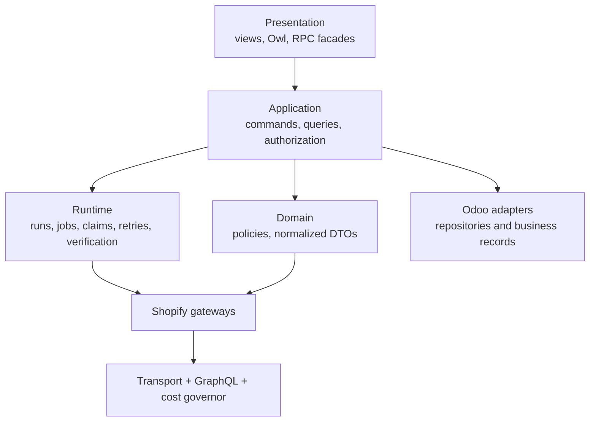

# V2 Backend Implementation Blueprint

> **Status:** implementation-ready target.  
> **Decision:** modular monolith in Odoo 19; staged refactor with bounded internal replacement.  
> **Compatibility baseline:** release candidate PR #210 at `44da1e006eb19f93e685bc9993935153292b84f7`.

## 1. Architectural rules

These are release-blocking, not suggestions:

1. Preserve existing addon technical names, model names, XML IDs, binding rows, store identities, configuration generations, jobs/logs and mutation evidence.
2. Keep Shopify I/O behind one adapter boundary and one pinned, non-user-editable API version constant.
3. Put business intent in explicit application commands; do not trigger remote side effects from generic `create()`/`write()` overrides.
4. Put source-of-truth, matching, quantity, total, retry and state-transition rules in testable domain policies.
5. Keep Odoo models as persistence/security adapters. Large orchestration methods move out behind compatible model methods.
6. Keep transactions short. No Shopify network call may hold a broad Odoo business-record lock.
7. Treat uncertain mutation outcomes as verification work, never as ordinary failures.
8. Keep company/store/configuration-generation checks at command admission and immediately before every side effect.
9. Use database uniqueness and claim/lease controls for correctness; UI disablement and in-process locks are not correctness mechanisms.
10. Add no external worker, event bus, queue framework, cache service or deployable.

## 2. Target dependency map



Allowed imports:

| Package | May import | Must not import |
| --- | --- | --- |
| `presentation`/models exposed to RPC | application contracts, Odoo framework | Shopify transport, domain handlers, secrets |
| `application` | domain, runtime ports, repository ports, Odoo exceptions | frontend code, raw HTTP, raw GraphQL envelopes |
| `domain` | Python standard library and local immutable DTOs | Odoo ORM, `requests`, controllers, runtime models |
| `runtime` | application/domain contracts, Odoo adapters, gateway ports | frontend code, domain-addon private modules |
| `integration/shopify` | transport libraries, normalized DTO definitions | presentation, Odoo business views |
| domain addons | core public ports/contracts | another domain addon’s private implementation |

CI must fail on reverse imports and direct network use outside `integration/shopify`.

## 3. Addon ownership

| Addon | Owns in V2 | Must retain |
| --- | --- | --- |
| `shopify_connector_core` | store/credential boundary, command/query facades, runtime, Shopify transport/executor, generic gateway infrastructure, runs/jobs/attempts/logs, readiness, UI shell | existing models/XML IDs, role XML IDs, company rules, generation fences |
| `shopify_connector_product` | import gateway, matching policy, product/variant bindings, scans, product attention provider | binding identity/uniqueness and deterministic matching behavior |
| `shopify_connector_product_export` | catalog diff, preview fingerprint, approval and mutation handler | source-of-truth/approval behavior |
| `shopify_connector_sale` | customer/order gateways, commercial evidence, order/customer bindings and review providers | imported commercial facts and total/customer safeguards |
| `shopify_connector_inventory` | location mapping, inventory observations, first-push preview, quantity mutation handler | one-to-one mappings, Odoo authority only after explicit confirmation |
| `shopify_connector_fulfillment` | FulfillmentOrder read/selection, creation/tracking handlers, readback plan and timeline provider | picking trigger, notification confirmation and uncertainty safeguards |
| `shopify_connector_webhook` | HMAC endpoint, secret boundary, durable payload-free inbox, subscriptions, dispatch | deduplication and 30-day envelope retention |
| domain webhook satellites | topic/handler registration during migration | install/upgrade/uninstall behavior until consolidation is proven |

Do not fold webhook satellites during gateway/runtime/UI work. Packaging cleanup is the last optional stage.

## 4. Target package structure

The following structure is authoritative. Existing public model files remain and delegate into it until their compatibility methods can be removed.

```text
addons/shopify_connector_core/
├── application/
│   ├── __init__.py
│   ├── command_bus.py
│   ├── command_contracts.py
│   ├── authorization.py
│   ├── readiness.py
│   ├── commands/
│   │   ├── store_commands.py
│   │   ├── operation_commands.py
│   │   └── recovery_commands.py
│   └── queries/
│       ├── overview_query.py
│       ├── attention_query.py
│       ├── run_query.py
│       └── setup_query.py
├── domain/
│   ├── __init__.py
│   ├── authority.py
│   ├── errors.py
│   ├── identifiers.py
│   ├── retry_policy.py
│   └── states.py
├── integration/shopify/
│   ├── __init__.py
│   ├── transport.py
│   ├── graphql_executor.py
│   ├── cost_governor.py
│   ├── response_normalizer.py
│   ├── operation_registry.py
│   └── gateway_facade.py
├── runtime/
│   ├── __init__.py
│   ├── admission.py
│   ├── coordinator.py
│   ├── claimant.py
│   ├── attempt_executor.py
│   ├── verification.py
│   ├── reconciliation.py
│   └── observations.py
├── models/
│   ├── existing stable model files...
│   ├── shopify_connector_application_facade.py
│   ├── shopify_connector_ui_facade.py
│   ├── shopify_connector_run.py
│   └── shopify_connector_job_attempt.py
└── tools/
    ├── api_version.py
    └── redaction.py
```

Domain addons mirror only the parts they own:

```text
shopify_connector_<domain>/
├── application/
│   ├── commands.py
│   ├── queries.py
│   └── handlers.py
├── domain/
│   ├── policies.py
│   ├── dto.py
│   └── attention_provider.py
├── integration/shopify/
│   ├── gateway.py
│   └── operations.py
└── models/
    └── existing stable ORM models and compatibility facades
```

Files should normally stay below 500 lines and classes below 250 lines. Exceeding either requires a review note explaining cohesive ownership; numbers are review triggers, not permission to split one concept mechanically.

## 5. Core application contracts

### 5.1 Command envelope

Every command is immutable after construction:

```python
@dataclass(frozen=True)
class CommandEnvelope:
    contract_version: int       # exactly 1 for the first V2 release
    command_id: UUID            # caller-generated; duplicate-safe
    command_name: str           # allowlisted registry key
    store_id: int
    company_id: int
    expected_generation: int
    actor_uid: int | None        # None only for recorded system triggers
    trigger: str                 # user, cron, webhook, odoo_event, reconciliation
    requested_at: datetime
    payload: Mapping[str, object]
```

Validation order is fixed:

1. schema/type/allowlist;
2. authenticated actor and command-specific role;
3. active-company access to `company_id`;
4. store belongs to company and is not quarantined;
5. expected connection/configuration generation;
6. store/workflow readiness;
7. command-specific source-of-truth and preconditions;
8. idempotency/operation-scope allocation;
9. durable audit/run creation;
10. enqueue or execute the bounded local transaction.

The handler returns `CommandResult(status, run_ref, attention_ref, message, conflict_version)` and never returns an access token, raw response or stack trace.

### 5.2 Command bus

`CommandBus` is an explicit dict from command name to handler factory. Duplicate registration fails module load. Unknown commands fail closed. Handlers are ordinary Python classes receiving explicit dependencies:

```python
handler = StartOperationHandler(
    env=env,
    run_repository=OdooRunRepository(env),
    admission=AdmissionPolicy(...),
    coordinator=RunCoordinator(...),
)
```

There is no reflection from arbitrary model/method strings and no domain-specific conditional ladder in core dispatch.

### 5.3 RPC facades

Two Odoo `AbstractModel` facades are public to the web client:

- `shopify.connector.ui.facade`: explicit versioned read methods;
- `shopify.connector.application.facade`: explicit command methods.

Methods are named, not generic arbitrary dispatch:

- reads: `get_overview_v1`, `search_attention_v1`, `get_attention_detail_v1`, `get_run_v1`, `get_setup_v1`, `get_operation_options_v1`;
- writes: `start_operation_v1`, `resolve_attention_v1`, `retry_job_v1`, `cancel_job_v1`, `save_setup_step_v1`, `replace_credential_v1`, `test_connection_v1`, `activate_store_v1`, `pause_store_v1`.

Each method repeats server authorization. Web buttons and hidden menus are not security boundaries.

## 6. Query/read-model architecture

Read models are versioned JSON DTOs built by server-side query objects. They are not new sources of truth.

- Use ORM `read_group`, bounded searches and prefetch-aware reads first.
- Use reviewed SQL only where profiling proves ORM aggregation cannot meet the budget; parameterize all values and preserve record-rule semantics explicitly.
- Do not persist Overview/health cards.
- Do not put cache truth in the browser. Within-request memoization is allowed; cross-request caching requires invalidation evidence and a separate decision.
- One initial RPC per composed screen. Detail-on-selection may use one additional RPC.
- Every response includes `contract_version`, `generated_at`, `data_through`, `store_generation` and `correlation_id`.
- IDs sent to the browser are plain record IDs only after access checks; polymorphic references use allowlisted opaque refs, never arbitrary model names supplied by clients.

Attention is an aggregate, not a new generic business table in the first V2 release. Each domain registers an `AttentionProvider` that returns normalized items and resolves explicit `action_key` values. Providers cover existing manual-review jobs, mutation uncertainty, product match decisions, missing mappings, readiness failures and domain review records. A persistent generic case table may be proposed later only if assignment/snooze analytics prove it necessary.

Runs use an opaque `run_ref`. During Stage 1 a legacy job is exposed as `job:<id>`; after the additive run model exists, new requests use `run:<id>`. Query and route helpers accept both. The browser never parses the prefix.

## 7. Runtime records and responsibilities

V2 separates four concepts:

| Concept | Physical model | Responsibility |
| --- | --- | --- |
| Run/request | new `shopify.connector.run` | one user/system intent, scope, actor, overall result |
| Job/work item | existing `shopify.connector.job` | one executable unit with idempotency and operation-scope lock |
| Execution attempt | new `shopify.connector.job.attempt` | one worker claim/execution period, error/cost/timing observation |
| Mutation intent | existing `shopify.connector.mutation.attempt` | one durable remote-write intent and its certainty/readback evidence |

The existing `shopify.connector.job.log` remains append-only narrative evidence. No existing job or log is deleted or renumbered during migration.

### 7.1 Run

Minimum fields are defined in `07-data-and-api-contracts.md`. A run is created before jobs. Its result is a projection over child jobs and explicit cancellation state; callers cannot write it directly.

### 7.2 Job

Keep the accepted state vocabulary and legal transitions. Add nullable `run_id`, `parent_job_id`, `lane`, `lane_priority`, `available_at` and `sequence`. Preserve current uniqueness on `(store_id, idempotency_key)`, operation scope and mutation reconciliation.

A retry normally creates an execution attempt for the same job. A user retry from a terminal/review state follows the existing legal transition and does not create a second business request unless the command represents materially new intent with a new fingerprint.

### 7.3 Execution attempt

One row per claim records:

- job, attempt number, unique claim token and worker reference;
- claimed/started/finished/heartbeat times;
- outcome and normalized error class;
- retry decision and scheduled time;
- Shopify requested/actual cost, available budget and throttle delay;
- request/response digests and redacted correlation IDs;
- mutation-attempt reference where applicable.

Attempts are service-written, append-only after terminalization and never retried by editing history.

### 7.4 Claim algorithm

The database is the arbiter:

1. select due `queued`/`retry_waiting` jobs ordered by effective priority;
2. use PostgreSQL row locking with `FOR UPDATE SKIP LOCKED` in a bounded batch;
3. recheck store state, company, generation, operation scope and cancellation;
4. allocate attempt sequence/token and set owner/running timestamp atomically;
5. commit the claim;
6. perform remote I/O outside the claim transaction;
7. open a short transaction, verify claim ownership/generation and record result;
8. schedule retry, verification, review or terminal transition.

Batch size comes from the existing bounded drain configuration and is never unbounded. Stale owners are recovered using the existing sweep semantics; a stale claim does not imply the remote mutation was absent.

### 7.5 Priority and aging

Locked lanes, highest first:

1. `safety_verification`
2. `interactive`
3. `webhook`
4. `odoo_event`
5. `scheduled`
6. `reconciliation`

Within a lane order by `available_at`, `lane_priority`, then ID. Every 15 minutes of wait improves effective priority by one step up to—but never above—`interactive`; reconciliation cannot displace safety verification. This rule is pure, deterministic and unit-tested.

## 8. Transaction and side-effect boundaries

### 8.1 Read operations

Remote reads may execute without a durable run only for connection/readiness probes that already have explicit audit behavior. Business scans and user-launched reads create a run/job first.

For paginated imports:

1. read one bounded Shopify page;
2. normalize DTOs;
3. process the page in a savepoint with idempotent upserts;
4. record page evidence;
5. commit;
6. advance the durable checkpoint only after commit.

The next page cursor is run-local. Domain freshness/checkpoints are not advanced on a partially committed page. Reconciliation uses an overlap window to cover boundary updates.

### 8.2 Mutations

The mutation sequence is fixed:

1. authorize and admit;
2. build canonical business intent and precondition snapshot;
3. allocate idempotency and operation-scope keys;
4. create/confirm durable mutation evidence;
5. commit before transport;
6. mark transport attempted with claim token;
7. execute exactly one mutation request;
8. normalize response;
9. record direct success/clean failure, or `uncertain` on any after-send ambiguity;
10. if uncertain, enqueue the domain readback plan; do not replay;
11. resolve `applied`, `not_applied` or manual review from evidence.

No handler may wrap Shopify transport in an ORM savepoint and assume rollback undoes the remote write.

### 8.3 Conflicting operations

`operation_scope_key` is deterministic and as narrow as correctness allows, for example:

- product mutation: `product:<store>:<product_gid>`;
- inventory: `inventory:<store>:<inventory_item_gid>:<location_gid>`;
- fulfillment creation: `fulfillment:<store>:<picking_id>`;
- tracking update: `tracking:<store>:<fulfillment_gid>`.

The exact string is generated server-side from normalized identifiers. Clients cannot supply it. Conflicting non-terminal work is rejected or coalesced according to the domain handler; it is never allowed to race because two UI requests arrived together.

## 9. Shopify boundary

### 9.1 Transport

`ShopifyTransport` owns only HTTPS mechanics:

- endpoint from the centralized `SHOPIFY_API_VERSION = '2026-07'` constant;
- connect/read timeout policy;
- headers and correlation IDs;
- credential retrieval without exposing it to caller logs;
- response byte limit;
- transport exception classification;
- redaction before any observation leaves the boundary.

It accepts an operation document and variables; it does not know product/order/inventory behavior.

### 9.2 GraphQL executor

`GraphQLExecutor`:

- uses variables only for business inputs;
- checks HTTP status and served `X-Shopify-API-Version` before success;
- parses JSON with bounded size/depth handling;
- normalizes top-level GraphQL errors, mutation `userErrors` and `extensions.cost`;
- returns `GraphQLResult(data, errors, user_errors, cost, request_id)`;
- never returns raw credential/header material.

Operation text is a checked-in constant with a stable operation name. No ad hoc GraphQL strings in handlers.

### 9.3 Cost governor

Governor state is per store and observational. Before a request, compute whether the last observed budget plus elapsed restore rate can cover the requested/estimated cost plus safety reserve. If not, schedule `available_at` with bounded jitter; do not sleep inside an Odoo worker transaction. Response cost extensions update the store’s throttle observation.

The governor cannot authorize a request otherwise blocked by readiness, operation scope or generation checks.

### 9.4 Domain gateways

Gateways are small and typed:

- `ProductReadGateway`
- `ProductMutationGateway`
- `OrderReadGateway`
- `CustomerReadGateway`
- `InventoryReadGateway`
- `InventoryMutationGateway`
- `FulfillmentReadGateway`
- `FulfillmentMutationGateway`
- `WebhookSubscriptionGateway`

Each method maps one use case to normalized DTOs. Raw Shopify dictionaries and GraphQL envelopes may not cross the gateway boundary.

## 10. Webhook architecture

The HTTP path is intentionally short:

1. read bounded raw body;
2. verify HMAC over the raw bytes using constant-time comparison;
3. validate canonical shop header, topic, API version and required delivery ID;
4. parse only after verification;
5. derive strict allowlisted identity and payload digest;
6. insert `shopify.connector.webhook.delivery` with unique `(store_id, delivery_id)`;
7. enqueue/coalesce a local job in the same transaction;
8. acknowledge without running domain synchronization.

Duplicate delivery returns success after verifying that the stored envelope belongs to the same store/topic/digest. A conflicting duplicate enters manual review. Raw payload bodies are never persisted. Delivery metadata retains the current 30-day policy.

Topic handlers register by exact topic and owning addon. Unknown but valid topics are recorded/ignored with explicit evidence, not dynamically imported. Reconciliation remains mandatory because webhooks may be delayed, duplicated, reordered or missed.

## 11. Domain handler contract

Every executable job type registers:

```python
JobHandlerSpec(
    job_type="inventory_push",
    addon="shopify_connector_inventory",
    lane="odoo_event",
    mutation=True,
    required_role=None,                # system trigger
    readiness_keys=(...),
    payload_schema=InventoryPushPayload,
    handler_factory=...,
    verification_factory=...,
)
```

Registration validates uniqueness and requires a verification strategy for every mutation handler. A mutation job with no registered readback plan fails module initialization/tests; it never defaults to blind retry. Domain uninstall retypes historical jobs through the existing historic sink and preserves evidence.

Handler result is one of:

- `Succeeded(observations)`
- `Skipped(reason, observations)`
- `Retryable(error_class, retry_at, observations)`
- `NeedsVerification(mutation_attempt_id, plan, observations)`
- `NeedsReview(reason_code, required_action, observations)`
- `TerminalFailure(error_class, no_safe_action, observations)`

Unexpected exceptions are normalized at the attempt executor and redact before persistence. They cannot silently choose a retry disposition.

## 12. Retry policy

Preserve the accepted error taxonomy. The default decision table is:

| Class | Default | Notes |
| --- | --- | --- |
| Shopify throttle/rate limit | retry | respect cost/`Retry-After`; bounded jitter |
| Temporary server/network before send | retry | exponential backoff |
| Temporary server/network after possible send | verify | mutation only; never blind replay |
| Permission/scope/auth | terminal or readiness block | requires Administrator correction |
| Shopify `userErrors`/validation | terminal or manual review | field-specific message |
| Odoo validation/configuration | readiness/manual action | no automatic loop |
| Missing mapping | manual review | exact remediation |
| Duplicate/idempotency/binding risk | manual review | confirmation required |
| Schema/data-shape mismatch | terminal, page-level stop | alerts API compatibility owner |
| Concurrency conflict | short bounded retry | only when side-effect absence is certain |
| Unknown system error | terminal/manual review | no retry until classified |

Preserve the accepted eligible-technical-retry policy: 30-second base, exponential multiplier 2, 30-minute cap, bounded ±20% jitter, at most 12 scheduled retries and a 24-hour retry window, stopping when either budget is exhausted. Shopify-provided delay or cost-governor availability may increase the next time. Domain handlers may be stricter but cannot make an ambiguous mutation retryable.

## 13. Security architecture

### 13.1 Roles

Preserve stable role XML IDs and implication graph:

- Auditor: read redacted evidence;
- Operator/User: routine operations;
- Reviewer: explicit matching/approval/recovery decisions;
- Administrator: configuration, credentials and high-risk actions.

The V2 UI may present the four job functions in help text, but it must not rename or rebuild the accepted XML IDs during refactoring.

### 13.2 Tenant isolation

- `company_id` is related/stored from the owning store on connector control-plane records.
- Global fail-closed record rules use active `company_ids`; a null company is not shared.
- Cross-record relations validate same store, not merely same company.
- Historic mismatches remain quarantined and invisible until explicit administrative remediation.
- Application services recheck company/store access before returning counts as well as records.

### 13.3 Secrets and PII

- Credential value is accepted only through the dedicated write-only method and isolated storage model.
- Read methods return `credential_present`, timestamps and scope posture only.
- A single redaction service covers logging, exceptions, payload samples, audit reasons and notifications.
- Raw webhook bodies are not stored.
- Query variables and normalized DTOs are classified by field; PII snapshots use existing retention/masking policy.
- Shopify admin links are built from validated domain/GID values and shown only to authorized users.

### 13.4 Threat checks per command

Every write method tests: forged store ID, inactive company, role bypass, stale generation, cross-store child ID, replayed command ID, modified preview fingerprint, malformed GID, overlong input, injected model/ref, secret in exception and concurrent duplicate submission.

## 14. Mapping current concentration to target seams

| Current hotspot at PR #210 | Target extraction | Preserve during extraction |
| --- | --- | --- |
| `shopify_connector_api_client.py` (~75 KB) | transport, executor, cost governor, response normalizer, gateway facade | public model methods and exact behavior through a compatibility facade |
| `shopify_connector_store.py` (~90 KB) | lifecycle commands, store repository, query projector | model/XML ID, state, generation and disconnect evidence |
| `shopify_connector_store_credential.py` (~81 KB) | credential repository/service and redaction boundary | protected storage and access posture |
| `shopify_connector_setup_wizard.py` (~99 KB) | setup commands, readiness registry, setup query | durable setup progress and accepted readiness rules |
| `shopify_connector_job_dispatch.py` (~84 KB) | handler registry, coordinator, claimant, executor, verification | state machine, idempotency, leases and recovery semantics |
| inventory service (~256 KB) | policy, query, preview, mutation and readback services | bindings, first-push guard and quantity authority |
| product export service (~152 KB) | diff/authority policy, preview service, mutation handler | preview/approval semantics |
| order importer (~134 KB) | normalized DTO mapper, commercial policy, repository, handler | binding/total/customer rules |
| product importer (~122 KB) | gateway mapper, deterministic matcher, repository, handler | binding and review decisions |
| webhook subscription (~91 KB) | subscription gateway, desired-state planner, reconciler | subscription identity and lifecycle evidence |

Extraction order is characterization → facade → pure policy/adapter extraction → parity → call-site migration → compatibility removal. No hotspot is rewritten in place without a seam and golden behavior tests.

## 15. Engineering quality gates

- New domain/application modules contain no raw SQL/HTTP unless they are the named adapter.
- Cyclomatic complexity above 10 or nesting above 4 in changed code requires refactoring or a written safety justification.
- No changed production file grows beyond 750 lines; hotspot files must decrease after their extraction PR.
- Public methods are typed/documented at the contract boundary; internal trivial helpers need no ceremonial docstrings.
- All timestamps are UTC in persistence and localized only in presentation.
- Money is never represented as binary float in new contracts; use decimal string plus currency.
- Shopify IDs are canonical GID strings at the integration/domain boundary.
- Logs are structured, redacted and include correlation/run/job/attempt references.
- Tests named for behavior and failure mode accompany every seam before old code moves.

## 16. Backend definition of done

A backend slice is complete only when:

- dependency direction is mechanically checked;
- compatibility calls and model/XML IDs are unchanged or migrated by an approved script;
- unit/contract/ORM/concurrency/mutation/security tests cover the slice;
- fresh install, warm upgrade and relevant uninstall path pass;
- query/API cost and runtime do not exceed the recorded budget;
- logs and returned problems contain no secret/PII leak;
- rollback is a store-scoped mode switch or forward-compatible code rollback, not database restoration;
- the old path remains available until the defined soak gate;
- evidence and the decision/traceability register are updated in the same PR.

## 17. Official engineering references

- [Shopify Admin API rate limits](https://shopify.dev/docs/api/usage/limits)
- [Shopify webhook engineering guidance](https://shopify.dev/docs/apps/build/webhooks)
- [Odoo 19 backend security](https://www.odoo.com/documentation/19.0/developer/reference/backend/security.html)
- [Odoo 19 performance guidance](https://www.odoo.com/documentation/19.0/developer/reference/backend/performance.html)
- [Odoo 19 testing guidance](https://www.odoo.com/documentation/19.0/developer/reference/backend/testing.html)
