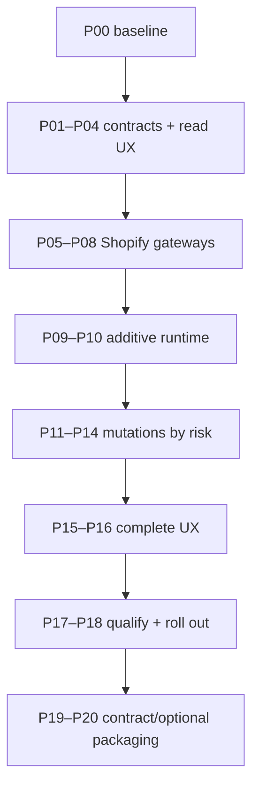

# Shopify Connector V2 — Implementation Blueprint

> **Status:** implementation-ready architecture/product package — docs only, 2026-08-30.  
> **Interactive design:** [Shopify Connector V2 Blueprint](https://shopify-connector-v2-blueprint.mostafaessam94.chatgpt.site).  
> **Planning base:** `Shopify-connector` at `dd6ecb8fe2d014989a86618035ef9bf1fe9f0b7b`.  
> **Current implementation evidence:** draft release PR #210 at `44da1e006eb19f93e685bc9993935153292b84f7`.  
> **Authority:** no production code is changed here. Implementation begins with packet P00 only after the architecture gate is accepted.

## Outcome

Build V2 through **staged refactoring with bounded internal replacement**.

Preserve customer data and proven safety: stores, bindings, model/XML identities, module lifecycle, jobs/logs, mutation evidence, idempotency/operation scopes, retry taxonomy, webhook deduplication, company/store-generation fences and domain authority rules.

Replace concentrated internals behind compatibility seams: Shopify API client, setup/store orchestration, job dispatch/runtime, server read aggregation and the composed production UI. A deeper replacement is permitted only if the defined proof gates show the existing persistent contracts cannot support safe extraction.

## Start here

| Need | Read |
| --- | --- |
| Approve product scope and operator experience | [01 Product experience](./01-product-experience.md) and [05 UX/design blueprint](./05-ux-design-blueprint.md) |
| Approve target backend | [02 Target architecture](./02-target-architecture.md), [06 Backend blueprint](./06-backend-implementation-blueprint.md), [07 Data/API contracts](./07-data-and-api-contracts.md) |
| Approve refactor/cutover safety | [03 Assessment](./03-refactor-vs-replacement.md), [08 Migration blueprint](./08-migration-and-cutover-blueprint.md) |
| Approve proof/release bar | [09 Test/observability/release](./09-test-observability-release-blueprint.md) |
| Assign implementation work | [10 PR roadmap](./10-implementation-roadmap.md), [12 lighter-model handoff](./12-lighter-model-execution-handoff.md) |
| Audit choices and coverage | [11 Decision/traceability register](./11-decision-and-traceability-register.md) |
| Review evidence/competition | [04 Evidence and competitor decisions](./04-evidence-and-competitor-decisions.md) |

## Complete package

| # | Document | Binding purpose |
| --- | --- | --- |
| 01 | [Product experience](./01-product-experience.md) | product promise, navigation, journeys, states, roles and success measures |
| 02 | [Target architecture](./02-target-architecture.md) | modular-monolith direction, contexts and runtime posture |
| 03 | [Refactor vs replacement](./03-refactor-vs-replacement.md) | preserve/refactor/replace matrix, escalation evidence and stage gates |
| 04 | [Evidence and competitors](./04-evidence-and-competitor-decisions.md) | official sources, repository facts, competitor patterns and learn/avoid decisions |
| 05 | [UX and visual design blueprint](./05-ux-design-blueprint.md) | exact shell, tokens, components, screens, response states, responsive/RTL/a11y and frontend structure |
| 06 | [Backend implementation blueprint](./06-backend-implementation-blueprint.md) | packages, dependencies, commands/queries, runtime, transaction, Shopify, webhook and security boundaries |
| 07 | [Data and API contracts](./07-data-and-api-contracts.md) | persistent models, additive schema, DTOs, commands, errors, idempotency and source-of-truth matrix |
| 08 | [Migration and cutover blueprint](./08-migration-and-cutover-blueprint.md) | modes, expand/backfill/switch, subsystem cutovers, cohorts, halt and rollback |
| 09 | [Test, observability and release blueprint](./09-test-observability-release-blueprint.md) | test profiles/lanes, behavior matrices, budgets, SLOs, alerts and exact release evidence |
| 10 | [Implementation roadmap](./10-implementation-roadmap.md) | 21 ordered PR packets with allowed/forbidden scope, gates and rollback |
| 11 | [Decision and traceability register](./11-decision-and-traceability-register.md) | 50 locked decisions, parameters, rejected-pattern checks and requirement mapping |
| 12 | [Lighter-model execution handoff](./12-lighter-model-execution-handoff.md) | precise read/act/test/stop/report protocol and reusable implementation/review prompts |

## V2 north star

An operator answers within seconds:

1. Is this store safe and operational?
2. What needs a person now?
3. What changed, why, and what happens next?
4. Can I act without duplicates, overwritten authority or a guessed remote result?

The product is a calm Odoo-native operations workspace, not a generic dashboard and not a second ERP.

## Non-negotiable invariants

- Shopify GraphQL Admin API is behind one typed, versioned integration boundary.
- Webhooks are verified/deduplicated hints; reconciliation covers missed/duplicate/out-of-order delivery.
- Every mutation passes authorization, company/store/generation, idempotency/scope, durable intent, observation and terminal-result gates.
- Any possible-after-send ambiguity is read back before retry.
- Source of truth is explicit by capability/field; matching never guesses from a name.
- Inventory first push requires explicit mapping, current observation, preview and Administrator confirmation.
- Fulfillment customer notification is explicit and audited.
- Standard Odoo views remain default; selective Owl owns only composed/dense workflows.
- No SPA router, global browser store, raw frontend Shopify calls, external worker, giant addon or per-feature addon explosion.
- No V2 refactor forces reconnect, binding recreation or loss of operational evidence.
- No permission fix uses UI hiding, `sudo()` aggregation or context-flag authorization.
- No old path/flag is removed before coexistence, canary, rollback and soak gates.

## Implementation order

Backend contracts and real read models precede production UI wiring. Read-only runtime precedes any V2 mutation. Connector-owned webhook subscriptions prove desired-state administration first; inventory precedes product export; fulfillment is last. Contraction is after release, never a prerequisite for user value.

## Architecture gate

Review and record five decisions:

1. approve product/UX (`01`, `05`);
2. approve backend/data/API (`02`, `06`, `07`);
3. approve migration/release (`03`, `08`, `09`);
4. approve roadmap/execution protocol (`10`, `12`);
5. approve locked decisions/rejections/traceability (`11`).

When accepted, authorize **P00 only**. Each later packet is unlocked by its predecessor gate and evidence. The package leaves no design or architecture choice to the implementation model; it may stop only on a defined evidence conflict or authorization boundary.
